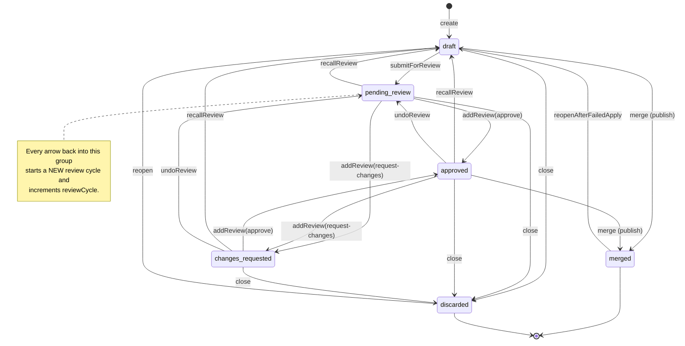
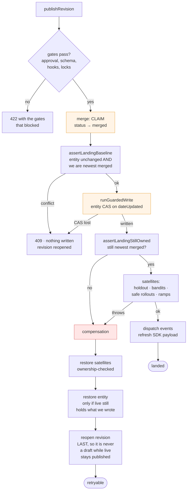
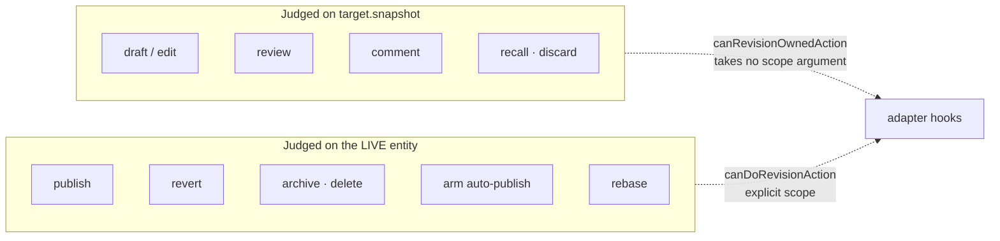
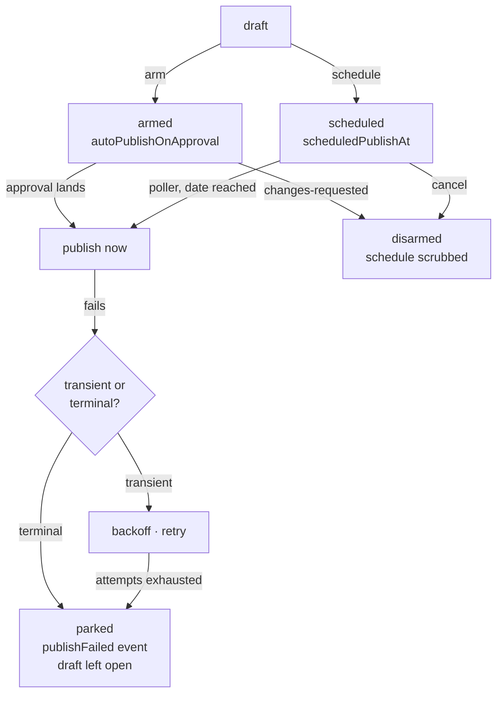
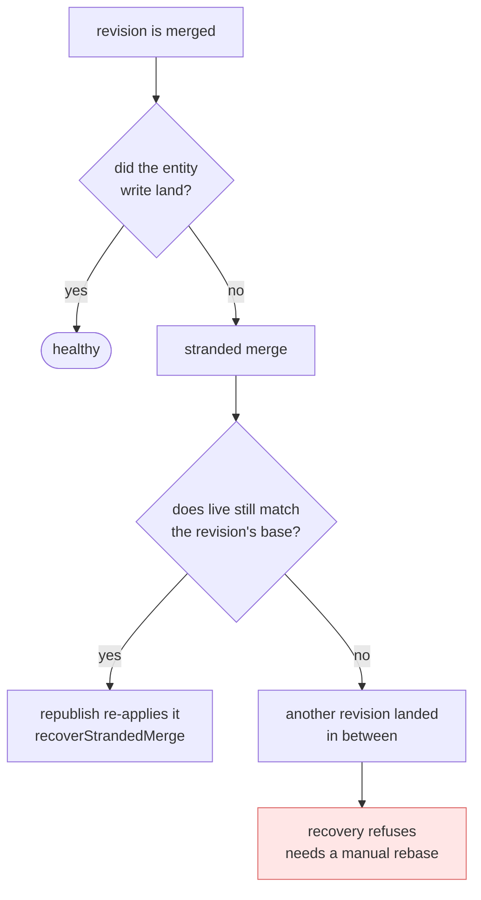

# The revision engines

Everything under `packages/back-end/src/revisions` exists to answer one question
safely: **how does a proposed change become the live state of an SDK-critical
entity, and what happens when that goes wrong halfway?**

There are two engines. They share their rules but not their mechanics:

|                | Generic engine                              | Feature engine                                     |
| -------------- | ------------------------------------------- | -------------------------------------------------- |
| Entities       | Configs, Constants, Saved Groups            | Feature Flags                                      |
| Model          | `RevisionModel` (`revisions` collection)    | `FeatureRevisionModel` (`featurerevisions`)        |
| Addressed by   | revision `id`                               | `(organization, featureId, version)`               |
| Change format  | JSON Patch ops over a snapshot              | whole-revision fields                              |
| Landing order  | claim first, then write live                | SINGLE publish writes live first, claims last      |
| Half-done look | claimed revision, live unchanged            | live changed, revision still open                  |
| Recovery       | republish routes via `recoverStrandedMerge` | rewinds at fail time + republish of the open draft |

**Bulk publishing is claim-first for BOTH engines.** `bulkPublish/` claims every
revision in the batch before writing any entity, so a bulk feature publish does
NOT follow the single-publish claim-last order above — its half-done shape is a
claimed revision with no entity write, the same as the generic engine, and it has
no `recoverStrandedMerge` equivalent (a crash mid-batch strands claimed revisions
for manual repair). The rows above describe the SINGLE-revision paths.

The rules live in one place: `landAuthority.ts` (who may discard / advance /
rebase / land — the feature engine reaches it through `featureDraftAuthority.ts`),
`reviewCycle.ts` (which round of review a verdict belongs to), and `casLoop.ts`
(the compare-and-swap skeleton). The landing mechanics are NOT shared — the two
engines put the claim at opposite ends of the sequence, so what a crash leaves
behind and how it heals differ per engine. Sections 2 and 5 describe the generic
engine; the feature engine's differences are called out where they matter.

---

## 1. Revision lifecycle

A revision is a proposed change plus the record of its review. `merged` and
`discarded` are terminal.

**Why `reviewCycle` exists.** Recall-then-resubmit returns a revision to
`pending-review` — the value it already held. A verdict formed against the
retracted round would satisfy every status check and land on the new one, so a
stale approve could approve changes nobody reviewed. Status cannot identify a
round; a monotonic counter can.

---

## 2. Landing a revision (generic engine)

The dangerous part. The merge claim lives in the revisions collection and the
entity write lives in another, and there are **no transactions** — DocumentDB
and CosmosDB have to keep working. Every step below exists because that pair
cannot be made atomic.

The feature engine runs this sequence **inverted**: guarded feature write →
satellites → re-fence on the feature's `dateUpdated` → claim
(`markRevisionAsPublished`) last, with rewinds registered at each step. Same
fences, opposite claim position — see section 5 for what that changes.

**The ordering rule in compensation is the whole point:** live state goes back
first, the revision record goes back last. A live change with no revision
recording it is the one outcome nothing can repair, so the record is kept
whenever live cannot be put back.

---

## 3. Who may do what, and on which basis

The single most repeated defect in this area was asking the right question about
the wrong entity. Verbs that belong to the **revision** are judged on
`target.snapshot` — the entity as it was when the draft was opened. Verbs that
**land** are judged on the **live** entity, because that is where the change
arrives.

`canRevisionOwnedAction` deliberately has no scope parameter: both bases have
the same TypeScript type, so a parameter is a standing invitation to pass the
wrong one.

**Authority is re-asked inside every CAS attempt.** A caller's permission check
runs once, against the row it read; the loop then re-reads on retry and can land
on a row a concurrent rebase moved into a project the caller holds nothing in.
Guarding the moved field does not close this — the guard makes the first attempt
lose, and the retry proceeds against the new row. `CasAuthority` is therefore a
required argument, with an explicit `authorizedByFlow` variant for writes whose
authority the calling flow already established.

---

## 4. Deferred publishing

A revision can be armed to publish later — on approval, on a date, or both.

Arming captures **acknowledgment fingerprints** of the content being armed. The
fire-time check reads them as consent, so arming guards `target` — content that
changed after the arm would otherwise publish under an acknowledgment nobody
gave.

---

## 5. When a landing does not complete

Each engine strands differently, because each puts the claim at a different end
of the sequence.

**Generic engine** — the claim comes first, so a crash strands a _claimed
revision with unchanged live state_:

`recoverStrandedMerge` **is** the republish path, not automation on top of it:
publishing a `merged` revision routes through it. The red branch is the case the
landing fences exist to prevent, and the reason they are worth their cost.

**Feature engine, SINGLE publish** — the claim comes last, so the failure surface
is inverted: a crash can leave _live changed with the revision still open_.
In-process failures run the registered rewinds (live restored first, revision
touched last, residue reported when a rewind is refused); a crash that outruns the
rewinds leaves an open draft whose changes are already live, and republishing that
draft re-applies and claims. There is no `recoverStrandedMerge` here — a feature
revision that reads `published` was claimed after its write landed, and
re-publishing it is refused rather than recovered.

**Feature engine, BULK publish** — claim-FIRST, like the generic engine: it strands
the OTHER way, a claimed revision with no entity write, and (like generic bulk) has
no stranded-merge recovery, so a crash mid-batch needs manual repair. Tracked debt.

---

## Reading order

1. `revisionActions.ts` — `publishRevision` is the spine; everything else hangs off it.
2. `landingSequence.ts` — the fences and the compensation ordering.
3. `casLoop.ts` — every guarded write goes through it.
4. `landAuthority.ts` — the shared authority rules. `revisionAuthority.ts`
   wraps them for the generic engine, `featureDraftAuthority.ts` for the feature
   engine; read the wrapper for the engine you are in.
5. `bulkPublish/` — the same sequence across several entities, all-or-nothing.
