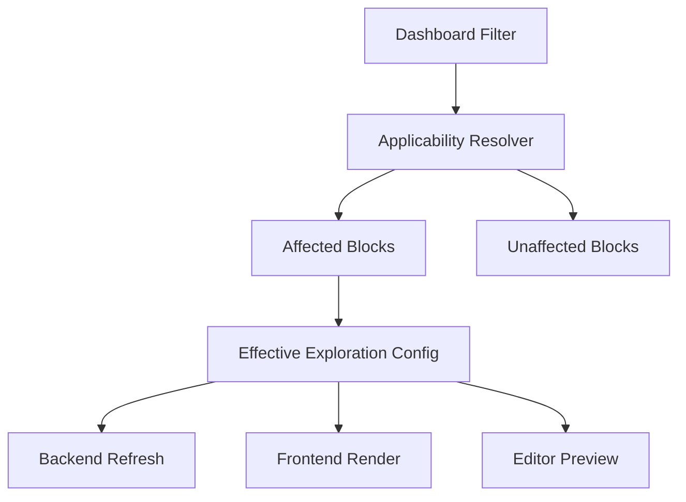

# Dashboard Dimension Filters Plan

## Goal

Introduce product analytics dashboard dimension filters that can apply across heterogeneous blocks without pretending every block has the same columns. Date filters remain a dashboard-level override. Dimension filters become additive constraints that apply only to compatible blocks/values.

## Design Principles

- Keep date and dimension semantics separate: `dateRange` overrides block date range; dimension filters append to row filters.
- Replace the branch-local all-or-nothing `useDashboardFilters` flag with per-filter applicability so a block can use the dashboard date range but ignore specific dimension filters.
- Make impact explicit in the UI: every dashboard filter should explain which blocks it affects and which it does not.
- Centralize effective-config logic in shared helpers so refresh, render, and editor preview all use the same behavior.



## Proposed Data Model

Add a richer filter model in [`packages/shared/src/enterprise/validators/dashboard.ts`](packages/shared/src/enterprise/validators/dashboard.ts):

- Keep `filters.dateRange` as-is.
- Add `filters.dimensionFilters`, a list of named dashboard filters.
- Each dimension filter stores the selected operator/values and explicit block targets.
- Targets identify how the dashboard filter maps to a block, likely by `blockId`, `valueId` or dataset value index, and `column`.

Conceptual shape:

```ts
filters: {
  dateRange?: ExplorationDateRange;
  dimensionFilters?: Array<{
    id: string;
    label: string;
    operator: RowFilter["operator"];
    values?: string[];
    targets: Array<{
      blockId: string;
      column: string;
      valueIndex?: number;
    }>;
  }>;
}
```

Evolve block opt-in in [`packages/shared/src/enterprise/validators/dashboard-block.ts`](packages/shared/src/enterprise/validators/dashboard-block.ts):

- Remove `useDashboardFilters` instead of preserving or migrating it; this field is not in production and only exists on local/branch data.
- Add replacement per-block filter settings, for example `dashboardFilterSettings`.
- Allow a block to opt into date but opt out of individual dimension filters.

## Applicability Resolution

Add shared helpers in [`packages/shared/src/enterprise/dashboards/utils.ts`](packages/shared/src/enterprise/dashboards/utils.ts):

- `getDashboardFilterApplicability` should expand beyond supported/unsupported block counts and return per-filter impact.
- Add a resolver that inspects product analytics exploration blocks and determines which dashboard dimension filters can apply.
- Add `getEffectiveExplorationConfig` support for dimension filters.

Dimension filters should be additive:

- Keep each block/value’s existing `rowFilters`.
- Append applicable dashboard row filters to each targeted dataset value.
- Do not mutate the saved block config while rendering or refreshing.

Date filters should remain override-based:

- If block uses dashboard date filter, effective config uses `dashboard.filters.dateRange`.
- Otherwise, effective config uses `block.config.dateRange`.

## Column Catalog And Union UX

Build a dashboard-level candidate catalog from eligible product analytics blocks:

- Inspect each `metric-exploration`, `fact-table-exploration`, and `data-source-exploration` block.
- Determine filterable columns for each block using existing product analytics/fact table column-source helpers.
- Group conservative matches first: same datasource, same column name, compatible type.
- Treat different names like `country` and `geo_country` as separate by default unless the user explicitly maps them together.

The UI should present the union as filter candidates with impact counts:

- `Country`, applies to 3 of 5 blocks.
- `Browser`, applies to 1 of 5 blocks.
- `Plan`, applies to 2 of 5 blocks.

## Frontend Changes

Extend [`packages/front-end/enterprise/components/Dashboards/DashboardEditor/DashboardFilterBar.tsx`](packages/front-end/enterprise/components/Dashboards/DashboardEditor/DashboardFilterBar.tsx):

- Keep the existing date range control.
- Add a dimension filter manager.
- Show impact summaries per filter.
- Allow editing target mappings and excluding blocks.

Extend block badges in [`packages/front-end/enterprise/components/Dashboards/DashboardEditor/DashboardBlock/index.tsx`](packages/front-end/enterprise/components/Dashboards/DashboardEditor/DashboardBlock/index.tsx):

- Show `Dashboard date` separately from dimension filter badges.
- Show `Filtered by dashboard: Country, Plan` for affected blocks.
- Show `Not affected by dashboard filters` for unsupported/unmapped blocks.

Extend product analytics sidebar handling in:

- [`packages/front-end/enterprise/components/Dashboards/DashboardEditor/DashboardEditorSidebar/ProductAnalyticsExplorerSettings.tsx`](packages/front-end/enterprise/components/Dashboards/DashboardEditor/DashboardEditorSidebar/ProductAnalyticsExplorerSettings.tsx)
- [`packages/front-end/enterprise/components/Dashboards/DashboardEditor/DashboardEditorSidebar/ProductAnalyticsExplorerSideBarWrapper.tsx`](packages/front-end/enterprise/components/Dashboards/DashboardEditor/DashboardEditorSidebar/ProductAnalyticsExplorerSideBarWrapper.tsx)
- [`packages/front-end/enterprise/components/ProductAnalytics/SideBar/ExplorerSideBar.tsx`](packages/front-end/enterprise/components/ProductAnalytics/SideBar/ExplorerSideBar.tsx)

Update the current `Use dashboard filters` switch into separate controls:

- Use dashboard date range.
- Apply dashboard dimension filters.
- Per-filter apply/ignore options when needed.

## Backend And Refresh Changes

Update [`packages/back-end/src/enterprise/services/dashboards.ts`](packages/back-end/src/enterprise/services/dashboards.ts):

- Ensure `updateDashboardExplorations` always uses the effective exploration config for both primary and comparison runs.
- Keep comparison behavior identical except date range changes for previous-period runs.
- Ensure dashboard dimension filters are included in the effective config before `runProductAnalyticsExploration`.

Update dashboard create/update handling in [`packages/back-end/src/routers/dashboards/dashboards.controller.ts`](packages/back-end/src/routers/dashboards/dashboards.controller.ts):

- Validate and persist dimension filter definitions.
- Replace the current branch behavior that writes `useDashboardFilters` with the new per-filter settings when a date filter is first added.
- Do not auto-apply new dimension filters to semantically ambiguous blocks unless the target mapping is explicit.

## Consistency And Staleness

Update render logic in [`packages/front-end/enterprise/components/Dashboards/DashboardEditor/DashboardBlock/ProductAnalyticsExplorerBlock.tsx`](packages/front-end/enterprise/components/Dashboards/DashboardEditor/DashboardBlock/ProductAnalyticsExplorerBlock.tsx):

- Use effective config for submitted state when rendering dashboard-filtered blocks.
- Detect config/result mismatch when dashboard filters changed but exploration data has not been refreshed.
- Prefer showing `Needs update` over rendering cached results with a mismatched effective config.

Update [`packages/front-end/enterprise/components/Dashboards/DashboardSnapshotProvider.tsx`](packages/front-end/enterprise/components/Dashboards/DashboardSnapshotProvider.tsx):

- Include comparison exploration query status where needed.
- Ensure dashboard filter changes trigger the correct refresh/update state.

## Rollout Path

1. Model and helper layer first: schema, applicability summaries, effective config merge.
2. Backend refresh support next: apply effective configs for primary/comparison runs.
3. Frontend read-only impact UI: show which blocks would be affected.
4. Add dimension filter creation/editing UI.
5. Add per-block/per-filter opt-out controls.
6. Polish staleness, refresh, and badges.
7. Delete the coarse `useDashboardFilters` field and any branch-local logic that depends on it once the new settings cover date and dimension behavior.

## Open Defaults

This plan assumes dimension dashboard filters should be row-level constraints applied before aggregation, not client-side filtering of already aggregated chart rows. That gives correct totals and trends, but requires rerunning affected product analytics explorations when filters change.
