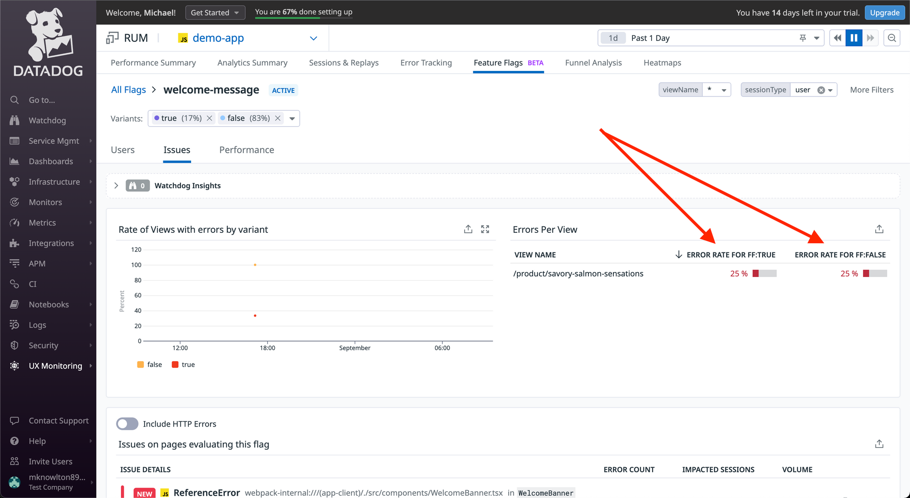
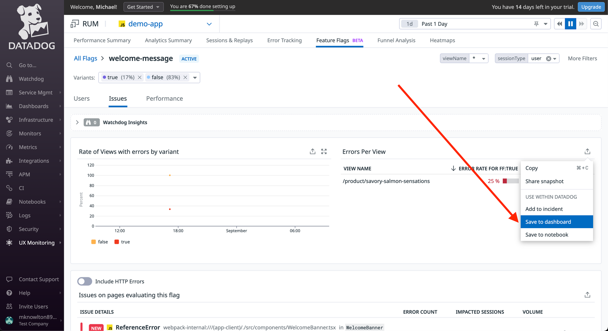
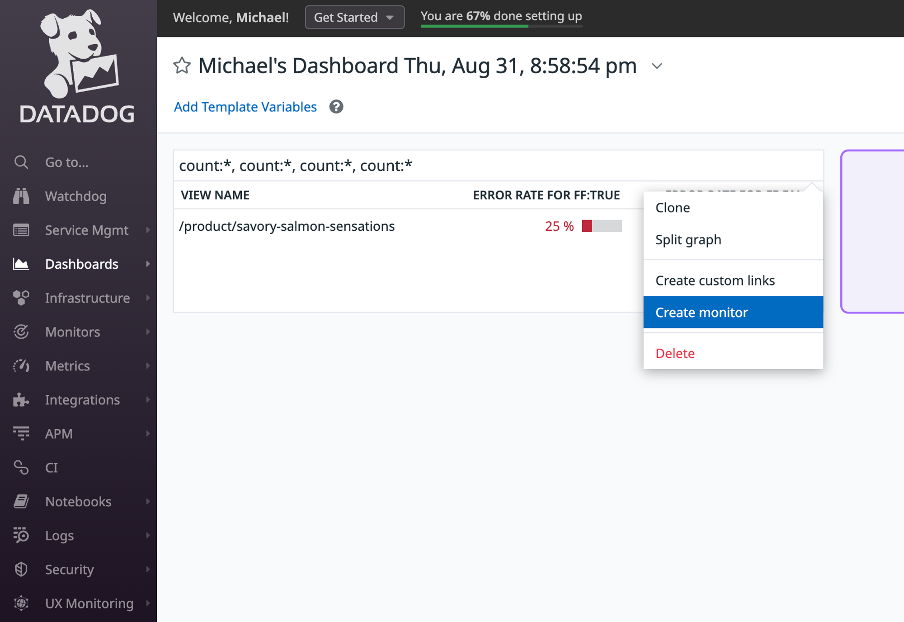
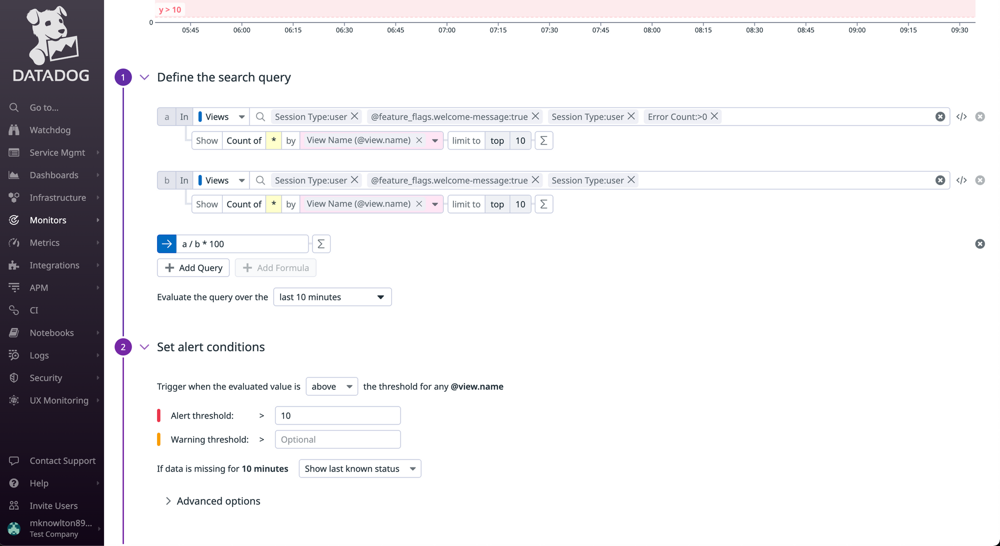
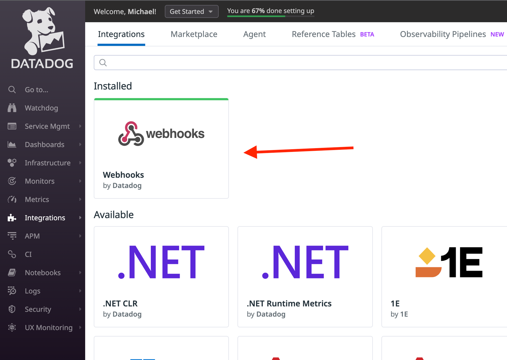
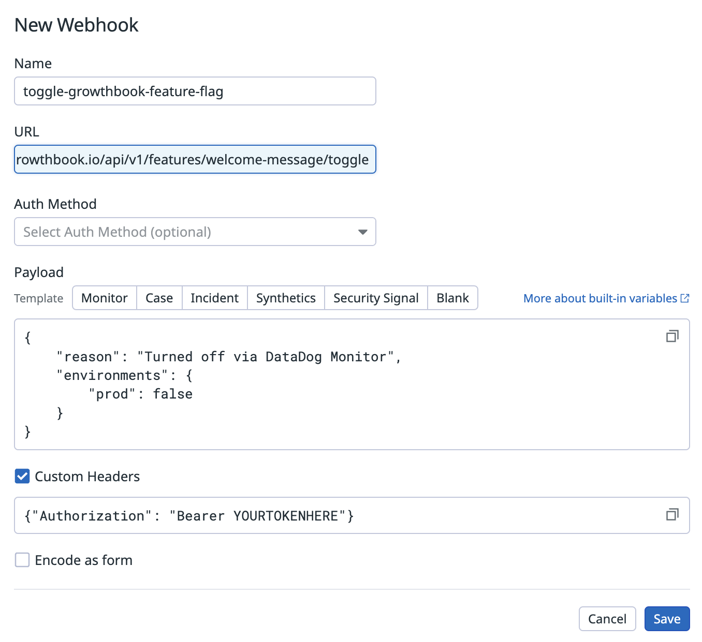

# DataDog Integration

## DataDog RUM with Feature Flag Data

Integrating DataDog's Real User Monitoring (RUM) with GrowthBook's feature flag data lets you quickly identify which experience your users were exposed to and if the changes introduced affect the user experience.

This guide will cover the initial setup and an advanced example of how to leverage DataDog and GrowthBook's powerful APIs to create a dynamic system that automatically toggles GrowthBook feature flags based on error thresholds.

### Setup

:::info Older DataDog RUM browser SDK versions

If your DataDog RUM browser SDK version is below v5.17.0, [enable feature flags during RUM SDK initialization](https://docs.datadoghq.com/real_user_monitoring/guide/setup-feature-flag-data-collection/?tab=browser#setup).

:::

We can report all feature flag evaluations to DataDog using GrowthBook’s SDK `onFeatureUsage` callback, as shown in the snippet below.

```javascript
const gb = new GrowthBookClient({
  onFeatureUsage: (featureKey, result) => {
    datadogRum.addFeatureFlagEvaluation(featureKey, result.value);
  }
});
```

### Advanced example

Now that you're passing Feature Flag data to DataDog, you can build monitors and alerts when the error rate between Feature Flags variations cross a specific threshold within a pre-defined time period.

#### 1. Create a DataDog monitor

The beta Feature Flag Tracking feature allows you to see error rates between the various feature flag states.



You can then save the Error rate view to a Dashboard.



And from the Dashboard, there is a handy “Create Monitor” option that can seed much of the monitor's search query for you.



This is the out-of-the-box search query created from the Create Monitor link above. You could take it a step further and calculate the difference in error rates between the Feature Flag variations (e.g. error rate when the Feature Flag is enabled vs disabled) and use that value as your alert threshold.



#### 2. Create a DataDog webhook

Once you've defined a monitor's search query, you can then build an alert that uses DataDog's Webhooks to make a request to the GrowthBook API.

Before you can call a [Webhook](https://docs.datadoghq.com/integrations/webhooks/) via a monitor alert, you'll need to build the Webhook within DataDog.

You can do that via the Integrations tab.



Once installed, you can build the Webhook that will turn the feature flag off for the desired environments.

Remember to update the Webhook URL with your feature flag ID [as described here](/api#tag/features/operation/toggleFeature).



#### 3. Update the monitor to trigger the webhook

Now that you've built the Webhook, you can go back to the monitor alert and instead of emailing a team member, you can configure the alert to call the Webhook.
