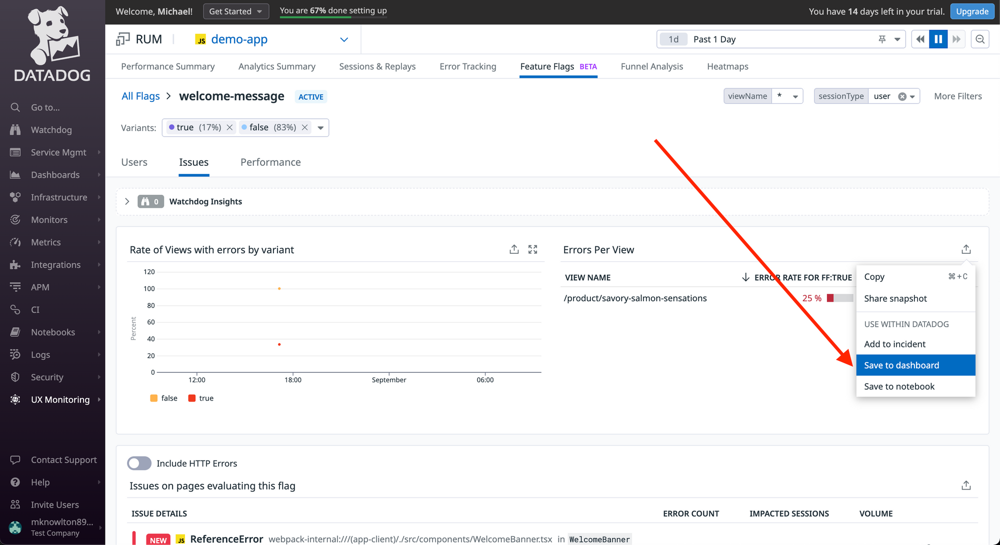
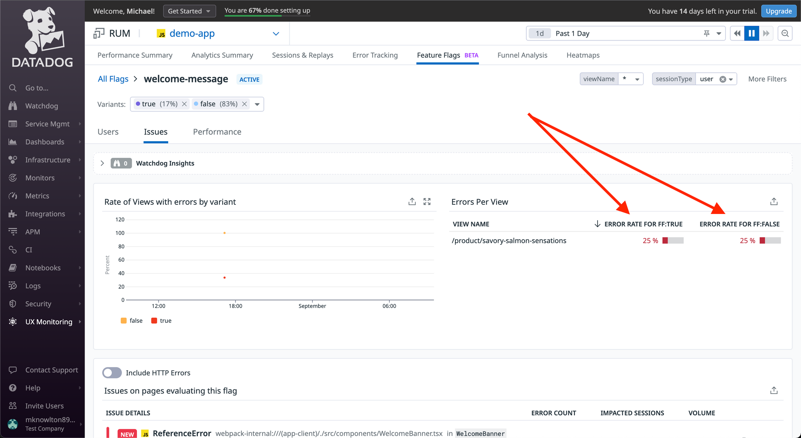
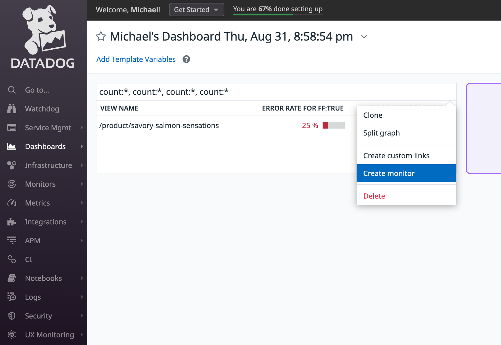
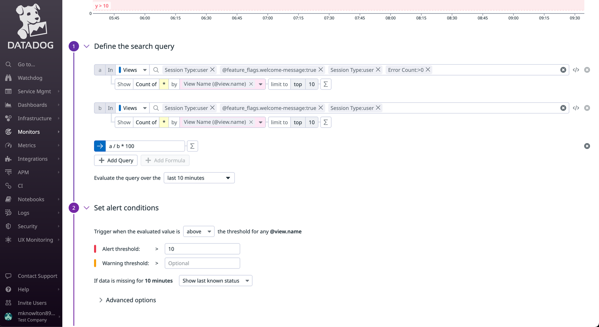
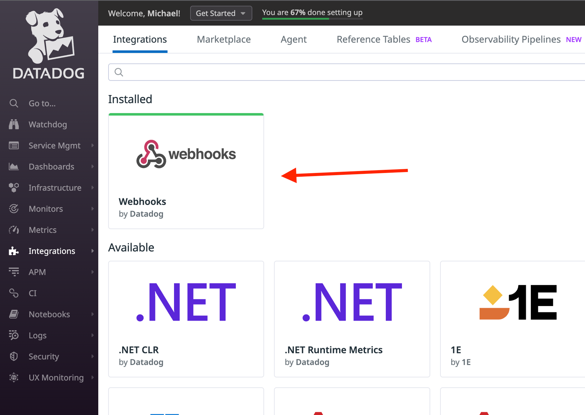
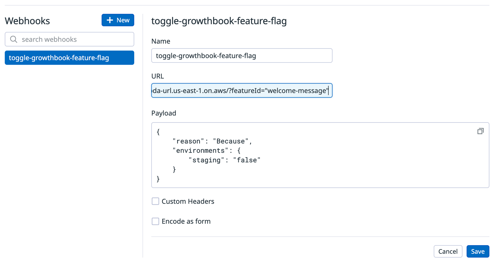
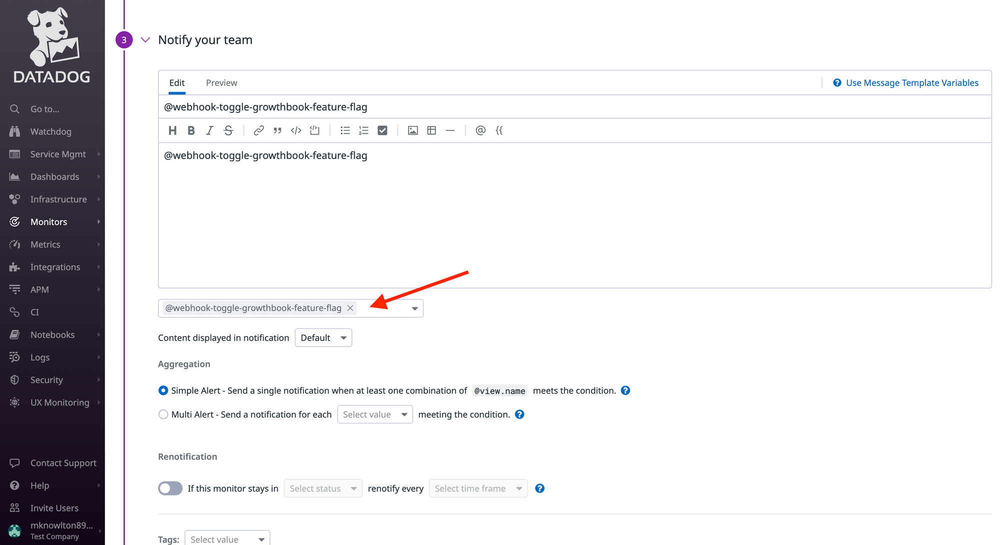

# Integrate DataDog with GrowthBook Feature Flag Data

By harnessing the power of DataDog's monitoring and alerting capabilities, along with GrowthBook&apos;s powerful REST API, you can create a dynamic system that automatically toggles GrowthBook Feature Flags when error thresholds surpass predefined thresholds.

## Setup Instructions

### 1. Instrument DataDog with Feature Flag Data

DataDog has a number of products that can be used to monitor applications. For this example, we'll focus on how to integrate
GrowthBook with [DataDog RUM](https://www.datadoghq.com/product/real-user-monitoring/).

To get started, you'll first need to instrument DataDog's RUM with their beta [Feature Flag Tracking](https://docs.datadoghq.com/real_user_monitoring/feature_flag_tracking/) feature.

When initializing `datadogRum` you can add `enableExperimentalFeatures` and pass in `feature_flags` to get access to the beta feature.

```ts
datadogRum.init({
  applicationId: "sample-application-id",
  clientToken: "sample-client-token",
  site: "datadoghq.com",
  service: "demo-app",
  env: "dev",
  version: "1.0.0",
  sessionSampleRate: 100,
  sessionReplaySampleRate: 100,
  trackUserInteractions: true,
  trackResources: true,
  trackLongTasks: true,
  defaultPrivacyLevel: "mask-user-input",
// This enables the beta feature flag tracking
  enableExperimentalFeatures: ["feature_flags"],
});

datadogRum.startSessionReplayRecording();
```

Then, you can use the `addFeatureFlagEvaluation` method built in to the `datadogRum` package when evaluating GrowthBook Feature Flags.

```ts
import { datadogRum } from "@datadog/browser-rum";
import { useFeatureIsOn } from "@growthbook/growthbook-react";

const welcomeMessage = useFeatureIsOn("welcome-message");

datadogRum.addFeatureFlagEvaluation("welcome-message", welcomeMessage);
```

:::info Note

If you are using [DataDog APM](https://www.datadoghq.com/product/apm/), you can do something similar by adding Feature Flag data to your traces. DataDog then
has a helpful guide on how to [Connect Rum & Traces](https://docs.datadoghq.com/real_user_monitoring/connect_rum_and_traces/?tab=browserrum).
This route will enable you do have alerts built around both front-end and back-end errors.

:::

### 2. Build a DataDog Dashboard & Monitor

Now that you&apos;re passing Feature Flag data to DataDog, you can build monitors and alerts when the error rate between Feature Flags variations cross a specific threshold within a pre-defined time period.



The beta Feature Flag Tracking feature allows you to see error rates between the various feature flag states.



You can then save the view to a Dashboard.


From the Dashboard, there is a handy “Create Monitor” option that can seed much of the monitor&apos;s search query for you.



This is the out-of-the-box search query created from the Create Monitor link above. You could take it a step further and calculate the difference in error rates between the Feature Flag variations (e.g. error rate when the Feature Flag is enabled vs disabled) and use that value as your alert threshold.



### 3. Build DataDog Webhook

Once you&apos;ve defined a monitor&apos;s search query, you can then build an alert that uses DataDog&apos;s Webhooks to invokes a serverless function (e.g. AWS Lambda).

Before you can call a [Webhook](https://docs.datadoghq.com/integrations/webhooks/) via a monitor alert, you&apos;ll need to build the Webhook within DataDog.

You can do that via the Integrations tab.



Once installed, you can build the Webhook that will invoke the serverless function. In this case, it&apos;s an AWS Lambda function that is invoked via a [Function URL](https://docs.aws.amazon.com/lambda/latest/dg/urls-invocation.html).



Now that you&apos;ve built the Webhook, you can go back to the monitor alert and instead of emailing a team member, you can configure the alert to call the Webhook.



### 4. Update Feature Flag via GrowthBook REST API.

The final step is to build a serverless function that hits the GrowthBook REST API endpoint to toggle status of a feature flag.

The [GrowthBook REST API](https://docs.growthbook.io/api/#tag/features/operation/toggleFeature) endpoint takes a simple POST request with basic HTTP auth and only requires the feature flag ID (the human-readable string), along with the environments you want to update and the new status of the Feature Flag for each environment.
