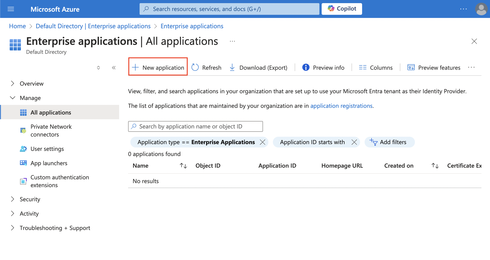
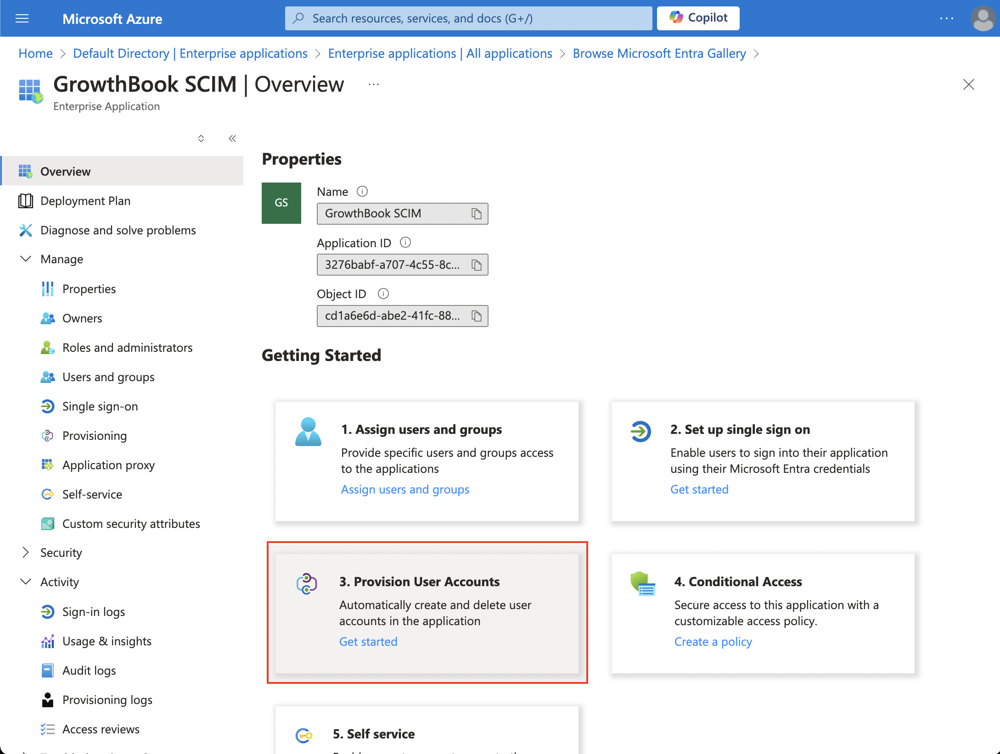
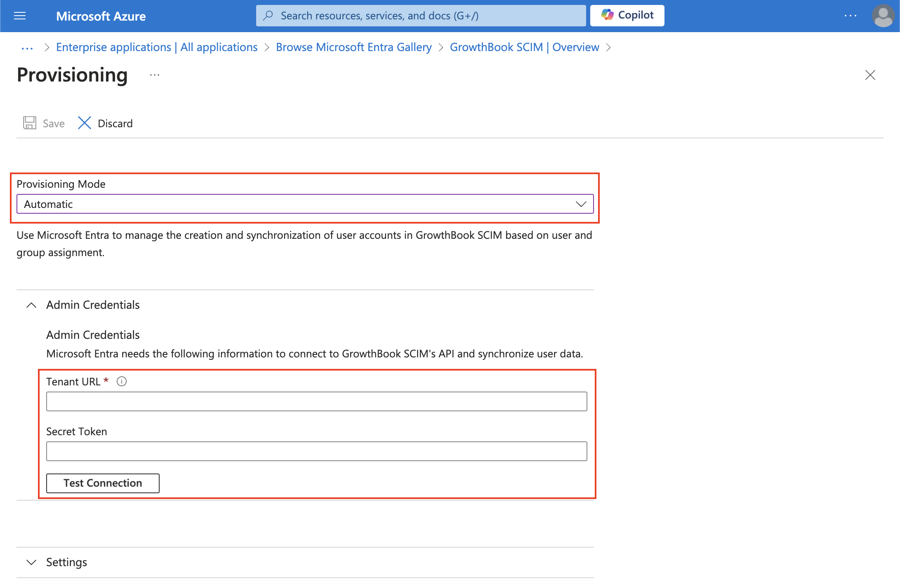
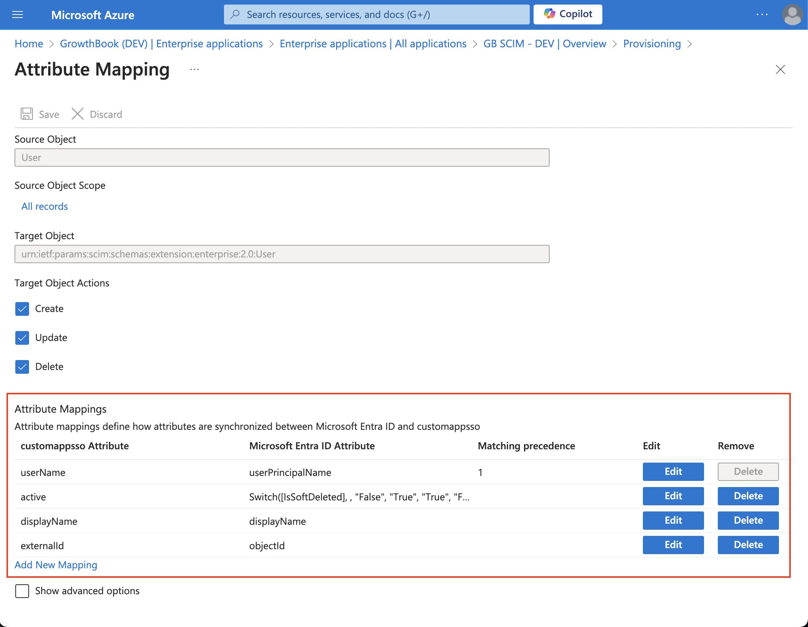
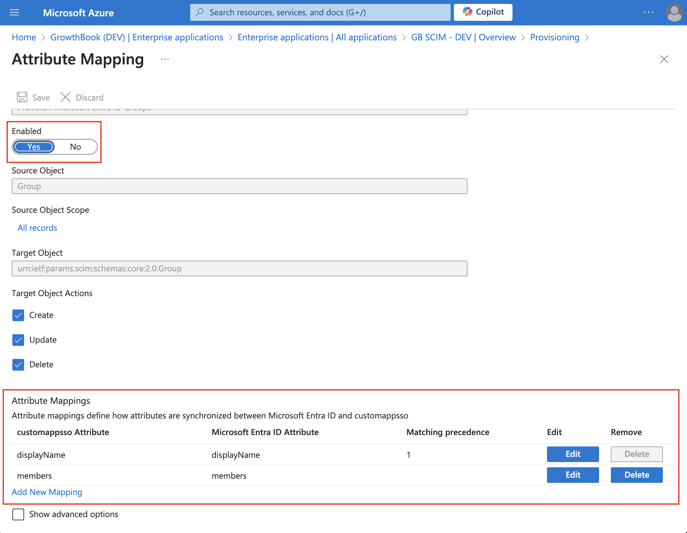

import CommercialFeature from '@site/src/components/CommercialFeature';

# SCIM Integration for Enterprise Organizations

<CommercialFeature feature="scim" description="SCIM requires Single Sign-On (SSO) to be enabled. Currently, GrowthBook only supports Okta and Azure AD/Microsoft Entra ID as identity providers." />

SCIM, or [System for Cross-domain Identity Management](https://scim.cloud/), is the standard for managing users and groups across multiple applications. With SCIM, you can automate the provisioning and deprovisioning of users in your GrowthBook account through your identity provider.

GrowthBook's SCIM integration currently offers the following features:

- User provisioning
- User deprovisioning
- Group Push

When a user is provisioned, they are added to your GrowthBook organization with your organization's default role. After provisioning, admin users can adjust their roles and permissions via the GrowthBook application as needed. It's important to note that if a user is provisioned through SCIM, they can only be deprovisioned through your identity provider.

GrowthBook does support the ability to optionally define a role when provisioning a user. See [Okta: How to Define User Roles When Provisioning](#okta-how-to-define-user-roles-when-provisioning) or [Azure AD: How to Define User Roles When Provisioning](#azure-ad-how-to-define-user-roles-when-provisioning) for detailed instructions. Project-level permissions are not supported when provisioning a user via SCIM. That must be done via the GrowthBook application.

When a group is added to "Push Groups" in your Okta SCIM application, groups and their members will be synced with GrowthBook via a corresponding [Team](/account/user-permissions). Please note that only members that have been provisioned into the GrowthBook app will be added to the Team in GrowthBook. For example, if you have a push group with members A, B, and C and only A and B are assigned to GrowthBook on the "Assignments" tab, the corresponding team on GrowthBook will only include members A and B. Just like how user provisioning works, new Teams will be set up with your organization's default role. You'll need to adjust the permissions for the Team in GrowthBook. Group removal or membership changes will need to be done through your identity provider.

:::note We are actively working on adding support for additional identity providers.

:::

## Configuring SCIM Integration

### Okta Setup

1. Verify that your GrowthBook organization is on an enterprise plan with SSO enabled.

2. Log in to your Okta account and go to the Applications page. Select "Browse App Catalog," then search for "SCIM 2.0 Test App (OAuth Bearer Token)." Click "Add Integration" to add the app to your Okta account.

3. Once the app is added, you can change its name, for example, to "GrowthBook SCIM." Click "Next."

4. On the next page, you don't need to modify any settings. Simply click "Done."

5. With the application created, click on the "Provisioning" tab and select "Configure API Integration."

6. Now you can enter the Base URL and your OAUTH Bearer Token.

- For GrowthBook Cloud users, the Base URL is `https://api.growthbook.io/scim/v2`. If you're self-hosting GrowthBook, the Base URL will be `{YOUR_API_HOST}/scim/v2`.
- You can obtain your OAuth Bearer Token by creating a new Secret API Key with an `Admin` role. To do this, go to your GrowthBook account, and in the left navigation, select "Settings → API Keys." We recommend creating a dedicated API key exclusively for your SCIM integration.

:::info Allowlist Okta's IP addresses

If self-hosting GrowthBook on a VPN or behind a firewall, allowlist [Okta's IP addresses](https://support.okta.com/help/s/article/list-of-ip-addresses-that-should-be-allowlisted-for-inbound-traffic?language=en_US) to ensure SCIM API calls can hit GrowthBook's SCIM server.

:::

7. After adding your credentials, click "Test API Credentials" to ensure they are valid. If they pass the test, click "Save."

8. Next, click on the "To App" tab and select "Edit" to enable "Create Users" and "Deactivate Users." Once enabled, click "Save."

9. Congratulations! Your application is now set up. You can navigate to the "Assignments" tab and assign people to GrowthBook and to the "Push Groups" tab to sync groups with GrowthBook Teams.

#### Okta: How to Define User Roles When Provisioning

1. First, ensure that you've followed the general setup instructions above.

2. In Okta, navigate to the Application you created for GrowthBook SCIM, and click on the "Provisioning" tab, and scroll to the "Attribute Mappings" section, before clicking "Go to Profile Editor".

3. Then, you'll click "Add Attribute" to create a new attribute. with the following details.

- Data type: string
- Display name: GrowthBook Role
- Variable name: growthbookRole
- External name: growthbookRole
- External namespace: urn:ietf:params:scim:schemas:core:2.0:User
- Check the box to define an enumerated list of values
- Here, you need to add the following enum Options
  - Display name: Read only
  - Value: readonly
  - Display name: Collaborator
  - Value: collaborator
  - Display name: Engineer
  - Value: engineer
  - Display name: Analyst
  - Value: analyst
  - Display name: Experimenter
  - Value: experimenter
  - Display name: Admin
  - Value: admin

:::info Exact capitalization required

It's important each of these values are entered exactly as shown above, including capitalization. If there is a descrepancy, the user's role will fall back to your organizations default role.

:::

4. Once complete, when you provision a user, you can select their role from the dropdown, and that will be applied to the user in GrowthBook. If you're not sure which role a user should have, you can [view GrowthBook role permissions](/account/user-permissions).

### Azure AD/Microsoft Entra ID Setup

The setup directions below are shown using the Azure Portal (e.g., portal.azure.com); however, the steps are the same if you're setting this up via the Microsoft Entra Admin Panel (e.g., entra.microsoft.com).

1. Verify that your GrowthBook organization is on an enterprise plan with SSO enabled

2. Log in to your Azure account, click **Microsoft Entra ID**, and in the sidebar menu, select **Manage** → **Enterprise Applications** → **+ New Application**

3. Select **+ Create your own application**, add an app name, and select **Integrate any other application you don't find in the gallery (Non-gallery)**.

3. Once created, select the box to **Provision User Accounts**

4. Click **Get Started**

5. Change the Provisioning Mode to **Automatic** before adding the Base URL and your OAUTH Bearer Token

- For GrowthBook Cloud users, the Base URL is `https://api.growthbook.io/scim/v2`. If you're self-hosting, the Base URL is `{YOUR_API_HOST}/scim/v2`.
- Obtain your OAuth Bearer Token by creating a new Secret API Key with an `Admin` role. To do this, open GrowthBook and go to **Settings** → **API Keys**. We recommend creating a dedicated API key for your SCIM integration.

:::info Allowlist Azure AD's/Entra ID's IP addresses

If self-hosting GrowthBook on a VPN or behind a firewall, allowlist Azure AD's/Entra ID's IP addresses to ensure the SCIM API calls can hit GrowthBook's SCIM server.

:::

7. After adding your credentials, click **Test API Credentials** to ensure they're valid. If they pass the test, click **Save**.

8. Once saved, enable/disable syncing of groups and users on the **Mappings** page. The two screenshots below show the necessary mappings. These must match exactly!

#### User Mapping

Customizing the attribute mapping is a critical step that enables the mapping of GrowthBook attributes to the correct Azure AD / Entra ID attributes. Below are the required attributes and how they need to be mapped for users.

| GrowthBook Attributes |               Azure AD / Entra ID Attributes                | Matching precedence |
| :-------------------: | :---------------------------------------------------------: | :-----------------: |
|       userName        |                      userPrincipalName                      |          1          |
|        active         | Switch([IsSoftDeleted], , "False", "True", "True", "False") |          -          |
|      displayName      |                         displayName                         |          -          |
|      externalID       |                          objectId                           |          -          |
|    growthbookRole     |  extension\_[appId]\_growthbookRole (or custom attribute)   |          -          |

#### Group Mapping (Optional)

Using groups simplifies providing users with custom permissions. When a user is added to a group and the group is provisioned to GrowthBook, we'll create a Team in GrowthBook, and all users of the team will inherit the team's permissions. See more [details on teams](/account/user-permissions#teams). If you don't plan on using `Teams`, you can disable group syncing and do not have to customize the attribute mapping.

If you are planning to use groups, below are the required attributes and how they need to be mapped.

| GrowthBook Attributes |              Azure AD / Entra ID Attributes              | Matching precedence |
| :-------------------: | :------------------------------------------------------: | :-----------------: |
|      displayName      |                       displayName                        |          1          |
|        members        |                         members                          |          -          |
|    growthbookRole     | extension\_[appId]\_growthbookRole (or custom attribute) |          -          |

:::info Syncing groups is optional

When a group is synced with GrowthBook, it creates a team in your GrowthBook organization and adds any members in the group to the team. This is handy because any role you assign to a team will also be inherited by its members. With Azure AD/Entra ID, all group members are synced to GrowthBook.

:::

:::info Premium edition required for group syncing

Your Microsoft Entra ID/Azure AD account must be a Premium edition to provision groups. Provisioning users is available for any Microsoft Entra ID edition.

:::

:::note Nested groups not supported

Microsoft Entra ID does not support the automatic provisioning of nested groups to GrowthBook. Microsoft Entra ID can only read and provision users that are immediate members of the explicitly assigned group. As a workaround, explicitly assign (or otherwise scope in) the groups that contain the users who need to be provisioned.

:::

#### Enabling Group Syncing

To sync Azure AD groups to GrowthBook Teams:

1. After configuring the attribute mappings above, navigate to **Manage** → **Provisioning** in your enterprise application.
2. Ensure the **Provisioning Status** toggle is set to **On**.
3. Navigate to **Manage** → **Users and groups**.
4. Click **Add user/group**, then select the groups you want to sync to GrowthBook.
5. Click **Assign** to add the groups to the application.
6. The groups will be automatically provisioned to GrowthBook as Teams during the next sync cycle (typically every 20-40 minutes).

When a group is provisioned:

- A corresponding Team is created in GrowthBook with the same name as the Azure AD group
- All members of the Azure AD group who have been provisioned to GrowthBook are automatically added to the Team
- The Team is assigned your organization's default role (unless you configure a custom role - see [Azure AD: How to Define Team Roles When Provisioning Groups](#azure-ad-how-to-define-team-roles-when-provisioning-groups))
- The Team is marked as managed by your identity provider

#### Azure AD: How to Define User Roles When Provisioning

1. First, ensure that you've followed the general setup instructions above and have configured the basic user attribute mappings.

2. In your Azure portal, navigate to your GrowthBook enterprise application, then go to **Manage** → **Provisioning** → **Mappings**.

3. Click **Provision Azure Active Directory Users** to edit the user attribute mappings.

4. Scroll down to find or add the `growthbookRole` attribute mapping. Click **Add New Mapping**.

5. Configure the mapping as follows:
   - **Source attribute**: You have several options:
     - **Extension attribute** (recommended): Use `extension_[appId]_growthbookRole` where `[appId]` is your enterprise application's ID. You'll need to define this extension attribute first (see step 6).
     - **Custom attribute**: If you've defined a custom attribute in Azure AD schema
     - **Expression**: Use an expression to map from existing attributes (e.g., map from `department` or `jobTitle` to a role)
   - **Target attribute**: `growthbookRole`
   - **Apply this mapping**: Select "Always"

6. If using an extension attribute, you'll need to define it in Azure AD:
   - Navigate to **Microsoft Entra ID** → **App registrations** → Find your enterprise application (or create a new app registration if needed)
   - Go to **Manifest** and add an extension property, or use an existing extension attribute
   - The extension attribute format is: `extension_[appId]_growthbookRole`
   - Note: You can find your application ID in the enterprise application's overview page

7. Define the valid role values. GrowthBook accepts the following role values (case-sensitive):
   - `readonly` - Read only
   - `collaborator` - Collaborator
   - `engineer` - Engineer
   - `analyst` - Analyst
   - `experimenter` - Experimenter
   - `admin` - Admin

:::info Exact capitalization required

It's important that each of these values are entered exactly as shown above, including capitalization. If there is a discrepancy, the user's role will fall back to your organization's default role.

:::

8. Click **Save** to apply the mapping.

9. If you're using an extension attribute or custom attribute, you'll need to populate it for each user in Azure AD. You can do this:
   - Manually for individual users in the Azure AD user properties
   - Via PowerShell scripts
   - Via Microsoft Graph API
   - Through bulk import/export operations

10. Once configured, when you provision a user, their `growthbookRole` attribute will be sent to GrowthBook and applied automatically. If you're not sure which role a user should have, you can [view GrowthBook role permissions](/account/user-permissions).

:::note Role updates

To update a user's role after they've been provisioned, you can update the `growthbookRole` attribute in Azure AD. The change will be synced to GrowthBook during the next provisioning cycle. Make sure your provisioning settings support "updates" for users.

:::

#### Azure AD: How to Define Team Roles When Provisioning Groups

1. First, ensure that you've followed the general setup instructions above and have configured the basic group attribute mappings.

2. In your Azure portal, navigate to your GrowthBook enterprise application, then go to **Manage** → **Provisioning** → **Mappings**.

3. Click **Provision Azure Active Directory Groups** to edit the group attribute mappings.

4. Scroll down to find or add the `growthbookRole` attribute mapping. Click **Add New Mapping**.

5. Configure the mapping as follows:
   - **Source attribute**: You have several options:
     - **Extension attribute** (recommended): Use `extension_[appId]_growthbookRole` where `[appId]` is your enterprise application's ID. You'll need to define this extension attribute for groups first (see step 6).
     - **Custom attribute**: If you've defined a custom attribute in Azure AD schema for groups
     - **Expression**: Use an expression to map from existing group attributes
   - **Target attribute**: `growthbookRole`
   - **Apply this mapping**: Select "Always"

6. If using an extension attribute, you'll need to define it in Azure AD for groups:
   - Navigate to **Microsoft Entra ID** → **App registrations** → Find your enterprise application (or create a new app registration if needed)
   - Go to **Manifest** and add an extension property for groups, or use an existing extension attribute
   - The extension attribute format is: `extension_[appId]_growthbookRole`
   - Note: You can find your application ID in the enterprise application's overview page

7. Define the valid role values. GrowthBook accepts the following role values (case-sensitive):
   - `readonly` - Read only
   - `collaborator` - Collaborator
   - `engineer` - Engineer
   - `analyst` - Analyst
   - `experimenter` - Experimenter
   - `admin` - Admin

:::info Exact capitalization required

It's important that each of these values are entered exactly as shown above, including capitalization. If there is a discrepancy, the team's role will fall back to your organization's default role.

:::

8. Click **Save** to apply the mapping.

9. If you're using an extension attribute or custom attribute, you'll need to populate it for each group in Azure AD. You can do this:
   - Manually for individual groups in the Azure AD group properties
   - Via PowerShell scripts
   - Via Microsoft Graph API
   - Through bulk import/export operations

10. Once configured, when you provision a group, its `growthbookRole` attribute will be sent to GrowthBook and applied to the corresponding Team automatically. All members of the Team will inherit this role. If you're not sure which role a team should have, you can [view GrowthBook role permissions](/account/user-permissions).

:::note Team role inheritance

When a team is assigned a role via `growthbookRole`, all members of that team inherit the team's permissions. This is a convenient way to manage permissions for multiple users at once.

:::

:::note Role updates

To update a team's role after it's been provisioned, you can update the `growthbookRole` attribute on the group in Azure AD. The change will be synced to GrowthBook during the next provisioning cycle. Make sure your provisioning settings support "updates" for groups.

:::

9. Add users and groups. Then, click **Start Provisioning**.

## FAQs

**What features are supported with SCIM?**

GrowthBook supports provisioning and deprovisioning users and groups.

**What identity providers are supported?**

GrowthBook officially supports Okta and Azure AD/Microsoft Entra ID. Given the standarized nature of SCIM, it's possible other identity providers will work, but we do not have official guides at this time.

**What happens if I deprovision a user in my identity provider?**

If a user is deprovisioned in your identity provider, they will be removed from GrowthBook. If they are re-provisioned, they will be added back to GrowthBook, and their role will reset to the organization's default role.

**All the users from my group aren't being synced with my GrowthBook team. What's happening?**

If you use Okta and notice that some users that you expect to be in your GrowthBook team from your identity provider are not being added in GrowthBook, double check that those users are assigned to the GrowthBook SCIM application in your identity provider.

- **Okta**: Only users that are both assigned and within the group are synced to the corresponding team.
- **Azure AD/Entra ID**: The user only needs to be in a group assigned to the application to be provisioned.

**What if I already have users in GrowthBook?**

Existing users in GrowthBook will not be affected by SCIM. You can continue to manage them through the GrowthBook application as usual. If you wish to transition them to be managed by your identity provider, you can provision them through your identity provider. As long as the email matches, the existing GrowthBook user will be converted to be managed by your identity provider.

**Does GrowthBook follow SCIM 1.1 or 2.0 Protocol?**

GrowthBook follows the SCIM 2.0 protocol.

**What happens if I provision a user with a role that doesn't exist?**

GrowthBook will fallback to your organization's default role.

**Can I provision a user with project-specific permissions?**

No, at this time, you can only provision a user's global role. Project-specific permissions must be managed through the GrowthBook application.

**Can I change a user's global role after they've been provisioned?**

Yes, you can change a user's global role through the GrowthBook application or via Okta. Please note that if you change a user's global role through the GrowthBook Application, it will then be out-of-date in Okta. If you then update the user in Okta, it will update the user's global role.

**I'm changing a user's role in Okta, but it's not changing in GrowthBook.**

For the user's role to be updated in GrowthBook, you must update your Application provisioning to support "updates." The only property GrowthBook supports updating is `growthbookRole`.

**Why can't I change a user's name via my identity provider?**

In GrowthBook, a user can belong to multiple organizations, so no single organization can update a user's name, as it would impact all organizations the user is part of.

**Can I define a user's `growthbookRole` via Azure AD/Microsoft Entra ID?**

Yes! See [Azure AD: How to Define User Roles When Provisioning](#azure-ad-how-to-define-user-roles-when-provisioning) for detailed instructions.

**I'm using Microsoft Entra ID/Azure AD and I'm unable to sync groups.**

Please ensure that your Microsoft Entra ID/Azure AD plan supports group syncing.

**Can I define a team's `growthbookRole` via Azure AD/Microsoft Entra ID?**

Yes! See [Azure AD: How to Define Team Roles When Provisioning Groups](#azure-ad-how-to-define-team-roles-when-provisioning-groups) for detailed instructions.

**How do I change a user's email address once provisioned?**
It's not possible to update a user's email after they're provisioned. Instead, follow these steps:

- Deprovision the user
- Update their email
- Reprovision the user

This process creates a net-new user in GrowthBook with the updated email address.
