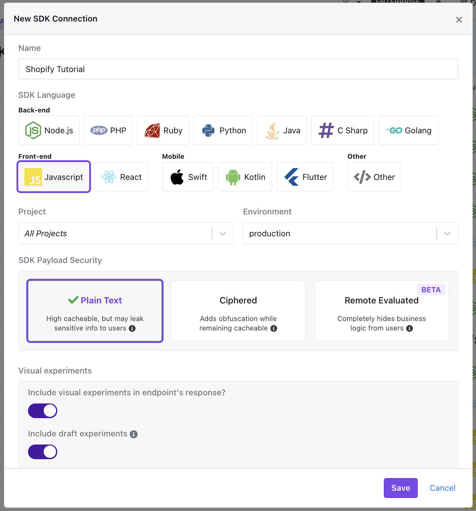

# Elevate Your Shopify Store with GrowthBook Experiments in Just 3 Simple Steps!

Unleash the power of experimentation with GrowthBook to supercharge your Shopify store—no coding skills required!

:::info Note

This guide walks you through creating experiments using the GrowthBook Visual Editor, which requires a `Pro` subscription [Learn More](https://www.growthbook.io/pricing).

:::

## Let's Get Started

### Step 1: Create a GrowthBook SDK Connection

To connect your GrowthBook account to Shopify, you'll need to create a new SDK Connection and select `Javascript` as the language.



### Step 2: Add GrowthBook to Your Shopify Theme

Once the SDK Connection is created, you'll want to locate the `Client Key` from the <strong>Implementation Instructions</strong> section.

Then, log into your Shopify account, navigate to your online store, and edit your store's code.


Once you're in the code editor, locate the `theme.liquid` file and add the following snippet to the bottom of the file, just before the closing `</body>` tag.

```js
    <script id="growthbook-sdk" src="https://cdn.jsdelivr.net/npm/@growthbook/growthbook/dist/bundles/index.min.js" defer></script>
    <script>

    <script async
      data-client-key="ADD_YOUR_CLIENT_KEY_HERE"
      src="https://cdn.jsdelivr.net/npm/@growthbook/growthbook/dist/bundles/auto.min.js"
    >
    </script>
```

:::info Note

Using the code snippet above automatically tracks experiment exposures with both GA4 (using dataLayer) and Segment (using analytics.track) when available. [Follow our guide here](https://docs.growthbook.io/app/visual#option-2-pre-built-script-tag-best-for-shopify-webflow) if you want to use a different analytics provider.

:::

Once added, click "Save" and navigate back to GrowthBook.

### Step 3: Create a GrowthBook Visual Editor Experiment

Now that GrowthBook is installed on your Shopify store, you can create a new experiment using the Visual Editor.

First, navigate to "Experiments" on the left-hand navigation menu and then click "Create Experiment", before selecting "Design a New Experiment" and following the on-screen prompts.

Once you've created your experiment, select "Visual Editor" as the editor type and enter the URL of your Shopify store.

You'll then be redirected to your store, where you can use the Visual Editor to update your store's content.

:::info Note

If you have questions about how to use the Visual Editor, [check out our guide here](https://docs.growthbook.io/app/visual).

:::
