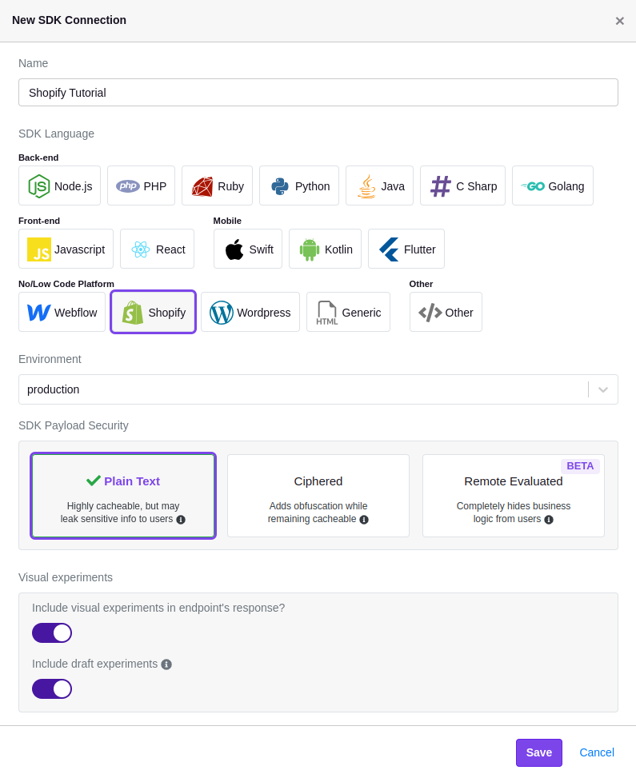
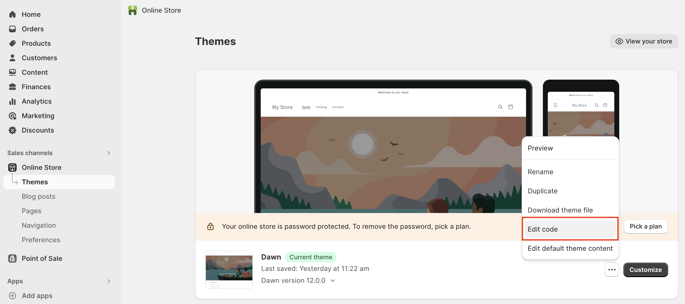
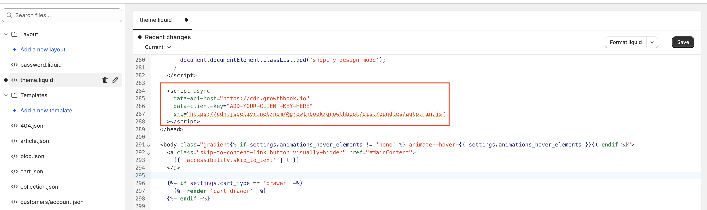
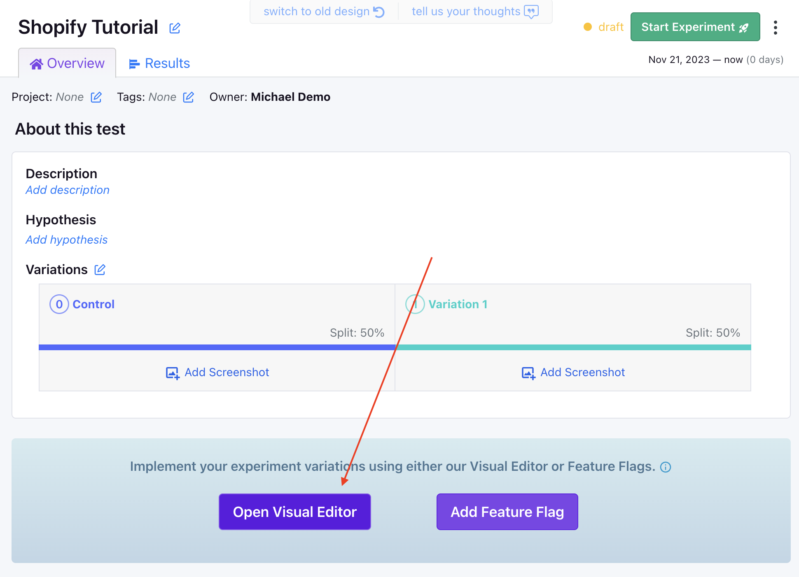

import CommercialFeature from '@site/src/components/CommercialFeature';

# Shopify Integration

Unleash the power of experimentation with GrowthBook to supercharge your Shopify store—no coding skills required!

<CommercialFeature feature="visual-editor" />

## Let's Get Started

### Step 1: Create a GrowthBook SDK Connection

To connect your GrowthBook account to Shopify, you'll need to create a new SDK Connection and select the `Shopify` option. Before saving, confirm that you've enabled the toggles for `Include visual experiments in endpoint's response?` and `Include draft experiments`.

### Step 2: Add GrowthBook to Your Shopify Theme

Once the SDK Connection is created, you should see a code snippet that you need to add to your store.

Log into your Shopify account, navigate to your online store, and edit your store's code.

Once you're in the code editor, locate the `theme.liquid` file and add the snippet exactly as shown just before the closing `</head>` tag. Here's an example of how it should look:

:::note Tracking experiment views

When a user views an experiment, this script will fire an event that tracks which variation the user saw. If you have Google Analytics 4 (GA4) or Segment installed on your store, you don't have to do any additional configuration. If, however, you need to use a different analytics provider, you can follow our guide [here](/lib/script-tag).

:::

Once added, click "Save" and navigate back to GrowthBook.

### Step 3: Install the GrowthBook DevTools Browser Extension

The GrowthBook DevTools browser extension enables you to use the Visual Editor to update your Shopify website content. Install it from the [Chrome Web Store](https://chromewebstore.google.com/detail/growthbook-devtools/opemhndcehfgipokneipaafbglcecjia) (Chrome) or from [addons.mozilla.org](https://addons.mozilla.org/en-US/firefox/addon/growthbook-devtools/) (Firefox).

Next, open the DevTools extension by clicking the extension icon.

- Find and click on the cog icon ⚙️.
- Enter your Personal Access Token (available in GrowthBook from the **main dropdown menu** → **Personal Access Tokens**).
- Click "Save". The GrowthBook browser extension is all set up!

### Step 4: Create a GrowthBook Visual Editor Experiment

:::tip Questions about the Visual Editor?

If you have questions about how to use the Visual Editor, [check out our guide here](/app/visual).

:::

Now that GrowthBook is installed on your Shopify store and you've installed the browser extension, you can create a new experiment using the Visual Editor.

First, navigate to "Experiments" on the left-hand navigation menu and then click "Create Experiment", before selecting "Design a New Experiment" and following the on-screen prompts.

Once you've created your experiment, select "Visual Editor" as the editor type and enter the URL of your Shopify store.

You'll then be redirected to your store, where you can use the Visual Editor to update your store's content.
