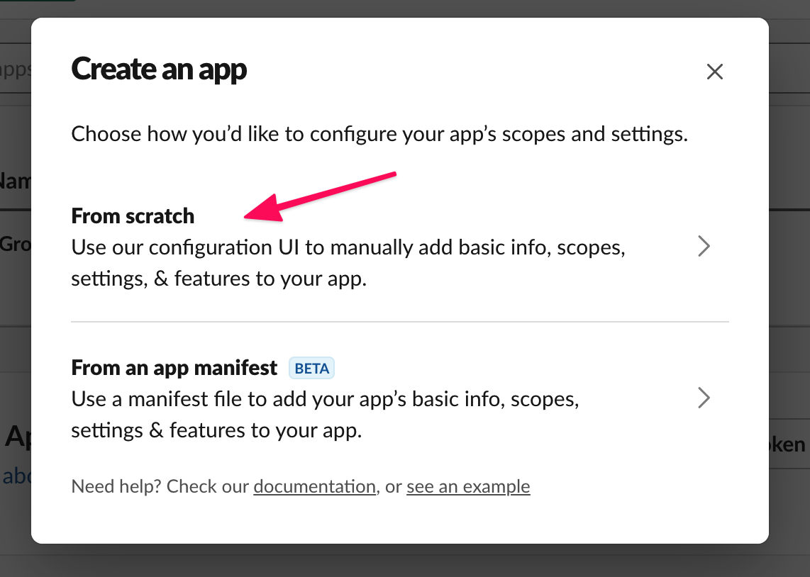
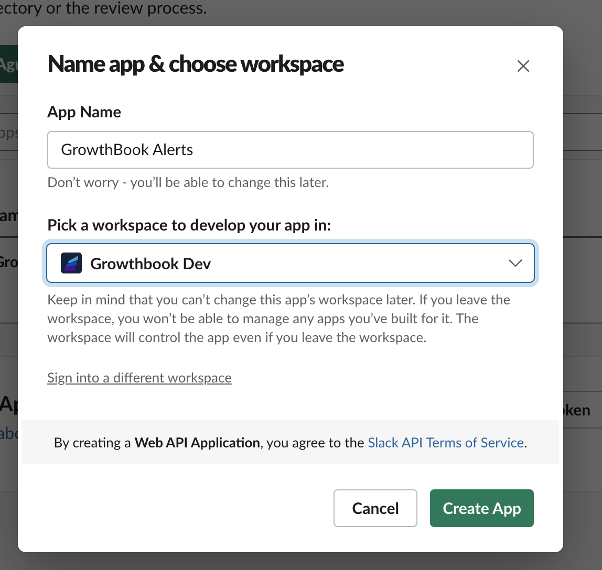
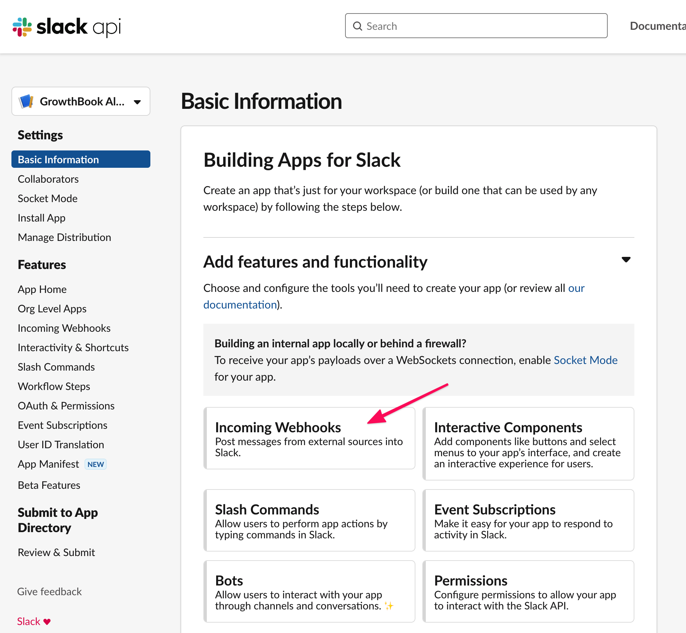
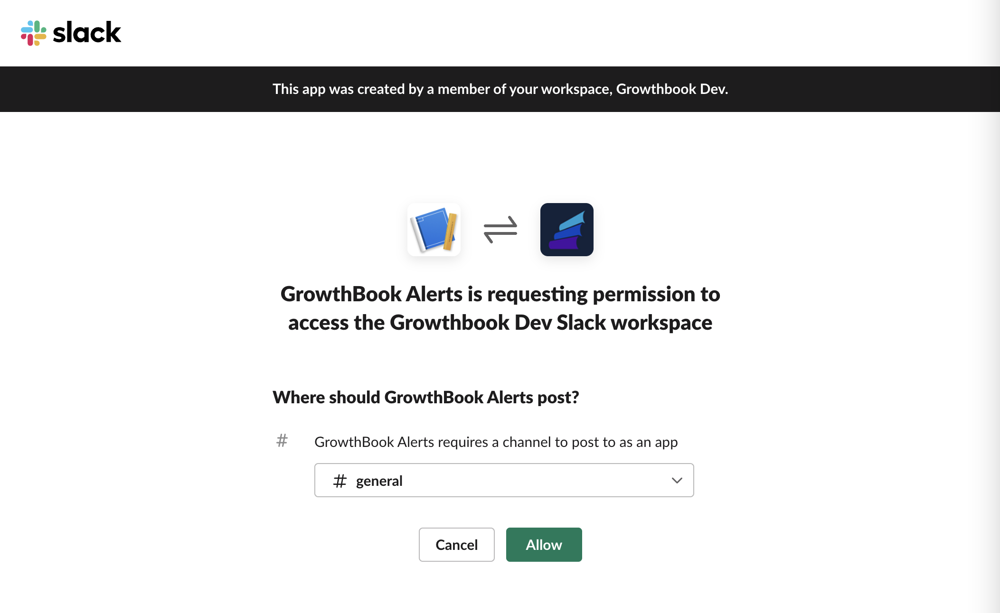
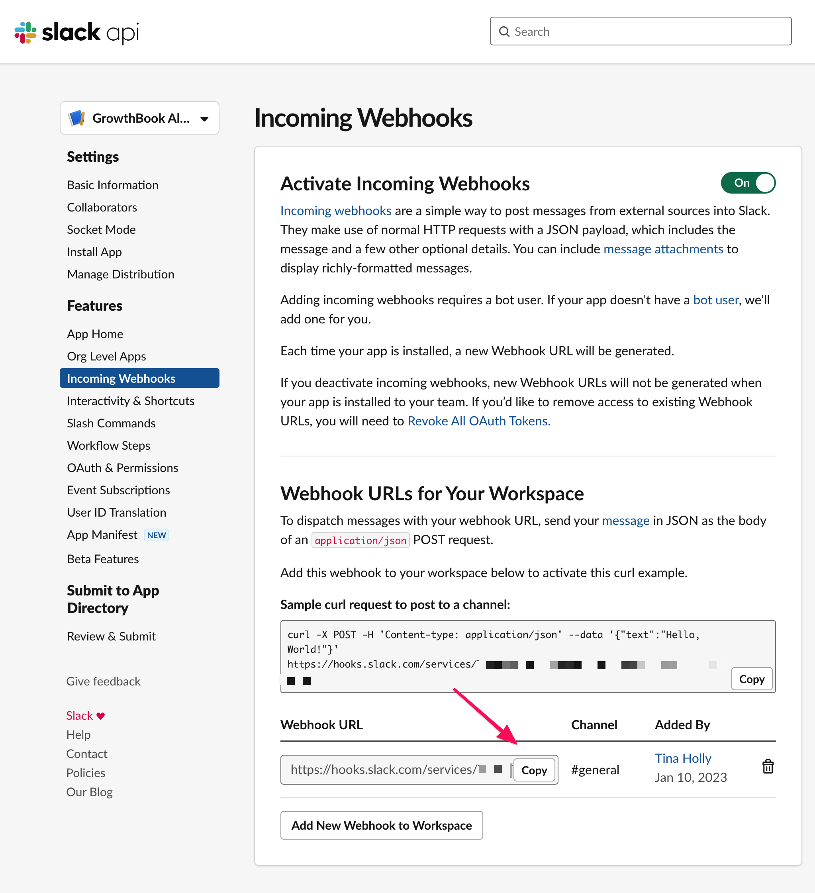
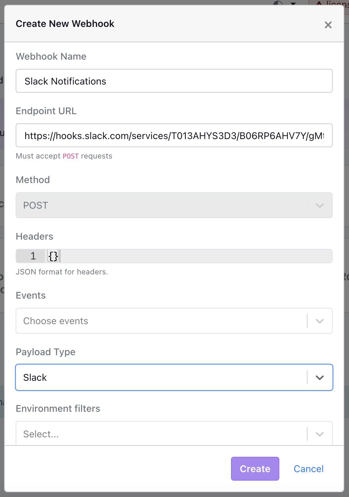
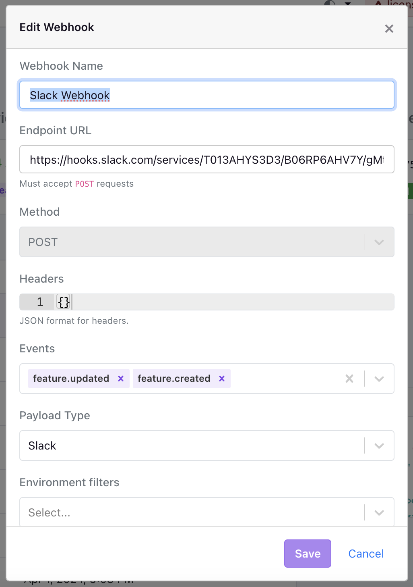

import ExternalLink from '@site/src/components/ExternalLink'

# Slack integration

The GrowthBook Slack integration allows you to receive alerts for the events that you care about in a Slack channel of your choosing.

## Creating and configuring an app in Slack

### Create a Slack app

The first step to setting up the GrowthBook Slack integration is to create a new app under your workspace's owned apps. You will need administrative privileges for your workspace in order to be able to manage apps.

Navigate to your workspace’s apps and choose to create a new app. You can get to that page directly [here](https://api.slack.com/apps?new_app=1).

Name the app and choose the workspace. In this case we are created the app named GrowthBook Alerts and are picking the GrowthBook Dev workspace.

### Create an Incoming Webhook

We will be alerting via Slack's incoming webhooks functionality. Under the **Basic Information** tab of your app, click on **Incoming Webhooks**.

### Subscribe a channel to alerts

Click on the button at the bottom of the **Incoming Webhooks** page that says **Add New Webhook to Workspace**.

You will be asked to install the app into your workspace. Choose the desired channel you'd like to receive notifications in.

Once you've completed this flow, you will see a URL available for you to copy. Save this value for later.

## Add the Slack integration to GrowthBook

Next step is to login to the GrowthBook app and visit the **Webhooks** tab under **Settings**, also available [here](https://app.growthbook.io/settings/webhooks). You will need privileges to manage webhooks in order for this menu item to be available.

Click the **Create an Event Webhook** button. You should see a modal pop up with some fields for configuring the Slack notification webhook.

Then, configure the following:

- **Name**: The name of the integration. In case you have multiple integrations, this can help you tell them apart. This will also show in the contextual text alongside the alerts.
- **Endpoint URL**: Copy and paste the webhook URL provided by your slack app.
- **Payload**: Select the `Slack` payload.
- **Event filters**: You can optionally filter by events you care about. For example, if you only care about when features are deleted, you can choose `feature.deleted` from the list. If you care about all events, leave this blank.
- **Environment filters**: You can optionally choose to filter by environment. For example, if you only want to hear about events that are for the production environment, you can choose `production` from the list. For all environments, leave this blank.
- **Project filters**: You can optionally choose to filter by project. For example, if you have a project named "Onboarding V2" and you only want to alert for that project, you can choose that project from the projects list. For all projects, leave this blank.
- **Tag filters**: You can optionally choose to filter by tag. For all events regardless of tag, leave this blank.

After configuring all the fields, press **Create** to save your new Slack notification webhook.

You can also edit these fields at any point if you make a mistake.

### Adding more alerts

If you'd like to be alerted in another Slack channel, you can add another Incoming Webhook in Slack.

Then, you can create new integrations in the GrowthBook dashboard, specifying all of the same information except adding your new webhook URL.

## Testing your alerts

You are now ready to test your alerts. First, you can hit the `Test` button on the webhook settings page. This should trigger a test notification.

Next, perform one of the actions you're watching if you've added Event filters. If you haven't added any event filters, the quickest way to test it's working is to either create a new test feature (then delete it if it's not needed), or toggle an environment on or off for an existing feature.
