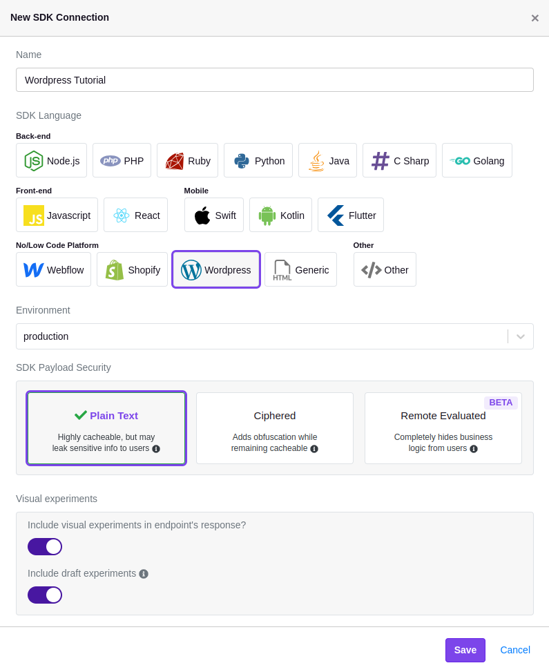
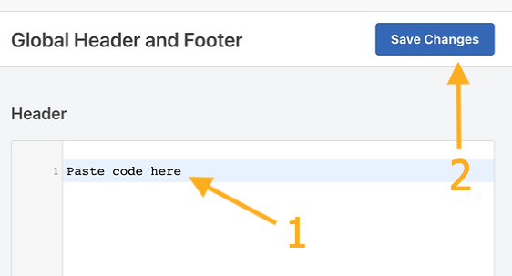

# Wordpress Integration

Unleash the power of experimentation with GrowthBook to supercharge your Wordpress site—no coding skills required!

:::info Note

This guide walks you through creating experiments using the GrowthBook Visual Editor, which requires a `Pro` subscription. [Learn More](https://www.growthbook.io/pricing).

:::

## Let's Get Started

### Step 1: Create a GrowthBook SDK Connection

To connect your GrowthBook account to Wordpress, you'll need to create a new SDK Connection and select the `Wordpress` option. Before saving, confirm that you've enabled the toggles for `Include visual experiments in endpoint's response?` and `Include draft experiments`.



### Step 2: Add GrowthBook to Your Wordpress Site

Once the SDK Connection is created, you should see a code snippet that you need to add to your site.

The easiest way to do this is with the popular [Insert Headers and Footers Plugin](https://wordpress.org/plugins/.insert-headers-and-footers/) by WPCode. Install and activate this plugin if you don't have it already.

On the left-hand side of your dashboard, navigate to Code Snippets → Header & Footer.

Insert the SDK Connection code snippet into your site's Head:



Here's an example of how it should look:

```html
<script async
  data-client-key="YOUR_CLIENT_KEY"
  src="https://cdn.jsdelivr.net/npm/@growthbook/growthbook/dist/bundles/auto.min.js"
></script>
```

:::info Tracking experiment views

When a user views an experiment, this script will fire an event that tracks which variation the user saw. If you have Google Analytics 4 (GA4) or Segment installed on your site, you don't have to do any additional configuration. If, however, you need to use a different analytics provider, you can follow our guide [here](/lib/script-tag).

:::

Once added, navigate back to GrowthBook.

### Step 3: Install the GrowthBook DevTools Browser Extension

The GrowthBook DevTools browser extension enables you to use the Visual Editor to update your Shopify website content. Install it from the [Chrome Web Store](https://chromewebstore.google.com/detail/growthbook-devtools/opemhndcehfgipokneipaafbglcecjia) (Chrome) or from [addons.mozilla.org](https://addons.mozilla.org/en-US/firefox/addon/growthbook-devtools/) (Firefox).

Next, open the DevTools extension by clicking the extension icon.

- Find and click on the cog icon ⚙️.
- Enter your Personal Access Token (available in GrowthBook from the **main dropdown menu** → **Personal Access Tokens**).
- Click "Save". The GrowthBook browser extension is all set up!

### Step 4: Create a GrowthBook Visual Editor Experiment

:::info Questions about the Visual Editor?

If you have questions about how to use the Visual Editor, [check out our guide here](/app/visual).

:::

Now that GrowthBook is installed on your Wordpress site and you've installed the browser extension, you can create a new experiment using the Visual Editor.

First, navigate to "Experiments" on the left-hand navigation menu and then click "Create Experiment", before selecting "Design a New Experiment" and following the on-screen prompts.

Once you've created your experiment, Add a Visual Editor change and enter the URL of your Wordpress site.

You'll then be redirected to your site, where you can use the Visual Editor to make changes.
