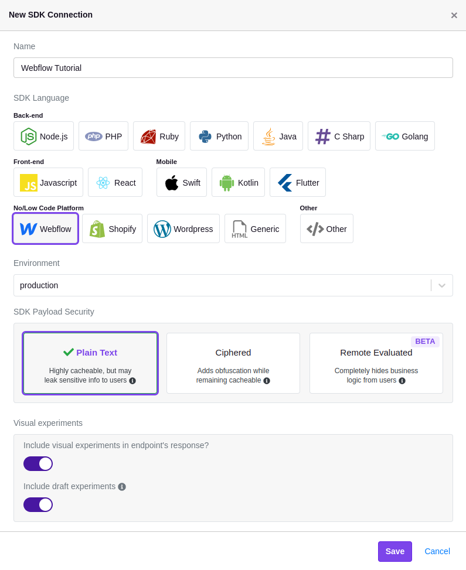

import ButtonCard from '@site/src/components/ButtonCard'

# Quick Start Guide

This guide will walk you through the basics of a full integration of GrowthBook for both feature flagging and A/B testing.
You can use GrowthBook for feature flags, running no-code experiments with a visual editor, analyzing experiment results, or any combination of the above. You're welcome to skip to the sections that apply best to your use case.

:::note

In our documentation we will use **AB test** and **experiment** interchangeably.

:::

## Set up GrowthBook

You can use GrowthBook hosted on our **cloud**, or you can choose to **self-host**. The easiest way is to use our cloud.
You can sign up for a free account [here](https://app.growthbook.io). If you want to self-host, you can follow the
instructions [here](/self-host) or on our GitHub page.

Once you have a GrowthBook account set up, you're ready to start feature flagging and experimenting!

## Feature Flags

### Step 1. Add an SDK connection

Once you're in the GrowthBook app, you need to add an SDK Connection to allow GrowthBook to communicate to your app in order
to use Feature Flags.
From the left nav, click on **SDK Configuration** and then **SDK Connections**. From this page, click on the
**Add SDK Connection** button. Name your SDK connection, then select the language you're using in your application,
and any additional options like including the visual experiments in the SDK payload. You can change any of these
settings later if needed. If you want to use GrowthBook with multiple languages, create a separate SDK Connection for each one.


With this SDK Connection created, you are now ready to install the SDK in your application. You will be shown tailored instructions based on the language and settings you selected.

### Step 2. Integrate GrowthBook into your application

The GrowthBook SDKs are used to evaluate feature flags and run experiments. You will see tailored instructions when you create the SDK Connection based on the language and settings you chose above. You can also access the [full SDK docs here](/lib).

The basics of installing the SDKs are:

- Grab the [GrowthBook SDK](/lib) package for your language
- Add the basic initialization code to your application
- Make sure the `clientKey` and `apiHost` are set correctly
- Add any targeting attributes you want to use for feature flags and experiments

:::tip

If your application has multiple languages or platforms, you can create a separate SDK Connection for each one. GrowthBook features and experiments will work the same across all languages, platforms, and environments.

:::

### Step 3. Create a Feature Flag

On the **Features** page, create your first feature flag.


The **Feature Key** is what you will reference in your application and it cannot be changed later.

Feature flags in GrowthBook are super powerful and support advanced [targeting](/features/targeting), powerful [rule evaluation](/features/rules), [pre-requisite features](/features/prerequisites), JSON Schema validation, and more. In this quick start, we'll just stick with a simple boolean feature flag that is either always ON or always OFF for everyone.

### Step 4. Use the Feature in your Application

When you create your first feature, you should see instructions for how to use it in your application. Here's an example using our JavaScript SDK:

```js
if (gb.isOn("my-feature")) {
    console.log("It's On!")
}
```

It really is that simple to get started! For next steps, we recommend reading our [Feature Flag Basics](/features/basics) page, which goes into more depth.

## No Code Experimentation

_Note: our Visual Editor requires a Pro or Enterprise license to use. There is a free 14 day trial available._

### Step 1. Create an SDK Connection

Navigate to **SDK Configuration** and then **SDK Connections** in the left nav. Then add a new SDK Connection. For the language choose any of the no/low code options - Webflow, Wordpress, Shopify, or Generic.



### Step 2. Add the Script Tag to your Website's Head

After you create an SDK Connection, you will be shown tailored instructions based on the nocode platform and settings you chose above. Typically this will involve adding a single script tag to the head of your website. It will look something like this (where `YOUR_CLIENT_KEY_HERE` is replaced by your uniquely generated client id):

```html
<script async
  data-client-key="YOUR_CLIENT_KEY_HERE"
  src="https://cdn.jsdelivr.net/npm/@growthbook/growthbook/dist/bundles/auto.min.js"
></script>
```

### Step 3. Install our Chrome Extension

Before using the Visual Editor, you must [install our Chrome Extension](https://chromewebstore.google.com/detail/growthbook-devtools/opemhndcehfgipokneipaafbglcecjia).

This extension will let you make changes to your website by pointing and clicking. Use it to test different headlines, CTA text, hero images, and more.

### Step 4. Create a new Visual Experiment

To use the visual editor, first add a new Experiment. This can be done under **Experiments** in the left nav.


Select the option to design a new experiment. Then, you'll have a series of fields to fill out (hypothesis, variation names, goal metrics, etc.). Don't worry, these can all be changed later.

Once you created an experiment, you should be prompted to open the Visual Editor.

Use the editor to make changes to your site and click the Done button when you are finished and you will get taken back to GrowthBook. We have an entire guide dedicated to [setting up and using the Visual Editor](/app/visual), so check it out if you get stuck or want to try some of the more advanced features like drag & drop re-ordering.

### Step 5. Start Your Experiment!

When you are ready, click the "Start Experiment" button and users will begin to be bucketed into your variations within seconds. You can just as easily stop or make changes if needed.

Follow the Experiment Analysis section below for how to connect GrowthBook to your data and view results. Depending on the analytics tool and data warehouse that you use, it can take up to 24 hours for results to start showing up after you start an experiment.

## Experiment Analysis

### Step 1. Connect to your data warehouse

GrowthBook is warehouse native: it connects to your data warehouse and queries it to get the results of your experiments.
We support all the popular SQL data warehouses such as BigQuery, Snowflake, Postgres, MySQL, Redshift, Databricks, and even Mixpanel.
GrowthBook is extremely flexible and can support almost any schema structure with a bit of configuration.

:::info **Don't have a data warehouse?**

Our most popular option is to have [Google Analytics 4 (GA4) sync data to BigQuery](/guide/GA4-google-analytics). We have a lot more options if that doesn't work for you. Read about them [here](/app/datasources).

:::

To connect GrowthBook to your data warehouse, you need to add a data source. Click on the **Metrics and Data** menu
from the left navigation, and then click on **Data Sources**. From here, click on the **Add Data Source** button. You'll be
presented with a list of data warehouses and event trackers. The data warehouse information will actually allow us to connect
to your data warehouse and execute queries with the credentials you provide. The event tracker information will allow us to
generate more accurate SQL templates given the schema the event tracker uses.
You can find guides on how to set up the data source for your specific data warehouse [here](/warehouses).

### Step 2. Add a metric or two

GrowthBook needs to know what metrics you want to measure for your experiments. For the easiest setup, we recommend using Fact Tables. You would generally create a Fact Table for each type of event (Sign Up, Purchase, etc.). Then, you can quickly create a library of metrics on top of these Fact Tables (Signup Rate, Revenue per User, Items per Order, etc.).

Go to **Metrics and Data** and then **Fact Tables** in the left nav. Add a Fact Table and edit the default SQL if needed. Here's an example SQL for an Orders fact table.

```sql
SELECT
  user_id,
  timestamp,
  qty,
  amount
FROM orders
```

Once the fact table is created, you can easily add metrics on top of it. We can start with a simple Proportion metric, which measure the percent of experiment users who complete an action at least once. In this case, we would be measuring the percent of users who purchase something.

Metrics in GrowthBook are very powerful and have many advanced settings. Read about them on our [Fact Tables page](/app/fact-tables).

### Step 3. View Experiment Results

Go to the **Experiments** page in the left nav. If you implemented an experiment using feature flags or our Visual Editor, you should already see it listed. Click through to it. If you ran your experiment outside of GrowthBook instead, that's fine too! Add a new experiment and select the "Analyze Existing" option.

Once inside your experiment, click on the Results tab. You may need to edit your analysis settings and pick the metrics you created earlier if you haven't already. You should see something like this:


We have an entire page in our docs just about these results and how to interpret them. Check it out [here](/app/experiment-results).

## Next Steps

<div className="row is-multiline">
    <div className="col col--4">
        <ButtonCard
            to={'/self-host'}
            title="Self-Host"
            description="Learn about running GrowthBook on your own infrastructure"
            style={{ height: '100%' }}
        ></ButtonCard>
    </div>
    <div className="col col--4">
        <ButtonCard
            to={'/lib'}
            title="SDK Docs"
            description="Learn about the GrowthBook SDKs"
            style={{ height: '100%' }}
            color="default"
        ></ButtonCard>
    </div>
    <div className="col col--4">
        <ButtonCard
            to={'/faq'}
            title="FAQ"
            description="Frequently asked questions"
            style={{ height: '100%' }}
            color="default"
        ></ButtonCard>
    </div>
</div>
