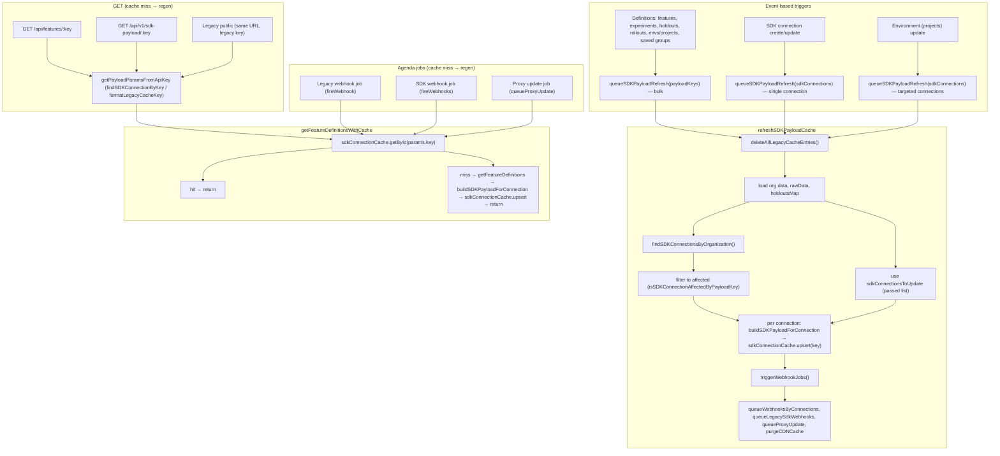

# SDK Payload Cache & Serve Flow

**Bulk path:** `payloadKeys` = scope only (`{ environment, project }[]`). We don't know connection cache keys at queue time. Refresh discovers them: load all connections (each has `connection.key`), filter to affected, then build + upsert per connection. **Delete legacy** = clear legacy API cache entries (not connection-keyed).

## Verified against main (current code paths)

| Flow | Code location | Status |
|------|---------------|--------|
| **Event triggers → queueSDKPayloadRefresh** | FeatureModel, ExperimentModel, SafeRolloutModel, savedGroups, holdout.controller, updateHoldoutStatus, VisualChangesetModel, UrlRedirectModel → `payloadKeys`. SdkConnectionModel, sdk-connection.controller → `sdkConnections: [connection]`. environment.controller, putEnvironment → `sdkConnections: affectedConnections`. | ✓ Matches |
| **refreshSDKPayloadCache** | features.ts:562–753. deleteAllLegacyCacheEntries → load rawData (features, experimentMap, groupMap, safeRolloutMap, savedGroups, visual/redirect) → holdoutsMapByEnv per env → sdkConnections = payloadKeys.length ? findSDKConnectionsByOrganization : sdkConnectionsToUpdate → forEach: filter (bulk) or use list, buildSDKPayloadForConnection → upsert → promiseAllChunks → triggerWebhookJobs. | ✓ Matches |
| **triggerWebhookJobs** | updateAllJobs.ts:17–56. queueWebhooksByConnections, fireGlobalSdkWebhooks, queueProxyUpdate (if enabled), queueLegacySdkWebhooks, purgeCDNCache. | ✓ Matches |
| **GET /api/features/:key** | controllers/features.ts getFeaturesPublic: getPayloadParamsFromApiKey(key) → getFeatureDefinitionsWithCache(context, params). | ✓ Matches |
| **GET /api/v1/sdk-payload/:key** | api/sdk-payload/getSdkPayload.ts: getPayloadParamsFromApiKey(key) → getFeatureDefinitionsWithCache. | ✓ Matches |
| **getPayloadParamsFromApiKey** | controllers/features.ts:182–266. sdk-* → findSDKConnectionByKey → connection params. Else legacy → lookupOrganizationByApiKey, formatLegacyCacheKey → legacy params (languages: ["legacy"]). | ✓ Matches |
| **getFeatureDefinitionsWithCache** | controllers/features.ts:272–353. getById(params.key) → hit: return parsed; miss: getFeatureDefinitions(...) → upsert (fire-and-forget) → return defs. | ✓ Matches |
| **Legacy webhook job** | webhooks.ts: fireWebhook uses formatLegacyCacheKey(webhook_${id}, env, project), getFeatureDefinitionsWithCache with legacy params. | ✓ Matches |
| **SDK webhook job** | sdkWebhooks.ts: getFeatureDefinitionsWithCache(context, params: connection) per connection. | ✓ Matches |
| **Proxy update job** | proxyUpdate.ts: getFeatureDefinitionsWithCache(context, params: connection). | ✓ Matches |

No regressions: all paths match the flowchart. Bulk and targeted both use one shared rawData load; connection list is either findSDKConnectionsByOrganization (bulk) or sdkConnectionsToUpdate (targeted).
