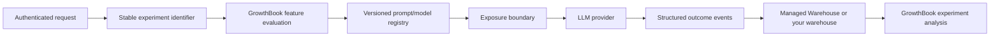

## TL;DR

This guide adds one controlled prompt or model experiment to a Node.js and TypeScript LLM workflow. GrowthBook selects a reviewed version key, while the repository owns prompt text, provider credentials, authorization, timeouts, privacy controls, and fallback behavior. Assignment stays stable, exposure occurs immediately before a real model call, and outcome events measure quality, reliability, latency, and cost without sending raw prompts or completions to GrowthBook.

The release moves from an unchanged control, to an internal canary, to a bounded production experiment, and then to a deliberate ship or rollback decision. A treatment that cannot pass offline evaluation, privacy review, deterministic tests, failure injection, and a documented stopping rule does not advance to production traffic.

_This guide is optimized for AI coding agents, and it is recommended that you hand it off to your agent of choice for implementation._

## Guide map

| Phase | What the agent does | Receipt to return |
| --- | --- | --- |
| 0 — Protect the control | Define the unit and experiment contract, version reviewed behavior in code, and prove control equivalence | Offline-evaluation results, control tests, privacy boundary, and disabled feature |
| 1 — Prove the treatment | Run an internal canary, verify activation-time exposure, and inject config and provider failures | Stable assignment, bounded telemetry, fallback behavior, and kill-switch proof |
| 100 — Experiment and decide | Ramp eligible traffic, monitor quality/cost guardrails, apply the stopping rule, and clean up | Health checks, decision record, production verification, and removal plan |

## Give this guide to your coding agent

Copy this page's URL and the prompt below into a coding agent that can inspect your repository. Replace `REPLACE_WITH_REPOSITORY` with the repository path or name and `REPLACE_WITH_GUIDE_URL` with this page's public URL. Start in a branch, worktree, or disposable clone, and use offline fixtures or approved synthetic inputs for the first pass.

```text
You are working in REPLACE_WITH_REPOSITORY.

Your task is to design and implement the non-production foundation for one
controlled LLM prompt or model experiment with stable assignment, activation-time
exposure, privacy boundaries, and quality, reliability, latency, and cost
guardrails.

Read REPLACE_WITH_GUIDE_URL in full before editing. Also read the repository's
local agent instructions. Treat the operator's instructions, repository truth,
and current official product/provider documentation as authoritative when they
conflict with the guide. Revalidate the guide's tested versions and volatile
surfaces before copying an executable step.

Preserve the known-good control. Do not invent a stable identifier, hypothesis,
business metric, stopping rule, consent basis, or provider capability. Do not send
raw prompts, completions, credentials, or direct personal identifiers to
GrowthBook. Complete phase 0 and the safe, non-production parts of phase 1. Do not
send real user traffic to a treatment, enable a production experiment, or make
another external write unless I explicitly authorize that exact action.

Return: your fit or reject decision; assumptions; files changed; commands and
tests run; control-equivalence, assignment, exposure, privacy, quality/cost,
failure, and rollback receipts; deviations from the guide; and the remaining
manual or production steps. If you cannot fetch the guide URL, stop and ask me
for its Markdown version. Do not proceed from the TL;DR alone.
```

## Task

Add a controlled production experiment to an existing Node.js/TypeScript LLM workflow. A stable user receives either the current prompt/model or one treatment. GrowthBook records exposure only when the application actually calls the model. The application records quality, reliability, latency, and usage outcomes without sending prompts, completions, email addresses, or other sensitive text to GrowthBook.

This guide is written so that a coding agent can implement the change in one pass. It includes the application boundary, complete reference files, GrowthBook configuration, event contract, tests, release sequence, failure branches, rollback procedure, and the criteria for deleting the experiment code.

The reference workflow is a support-answer generator, but the architecture also applies to summarization, extraction, classification, search reranking, recommendations, and agent steps.

## Use this guide when

- An LLM-backed capability already has a known-good production behavior.
- You want to compare one prompt, model, tool policy, or decoding change against that behavior.
- You can identify a stable randomization unit such as `user_id` or `account_id`.
- You can observe at least one outcome that represents user value, not just model activity.
- You need a kill switch and a defensible record of who received which treatment.

## Do not start a production experiment when

- The treatment has not passed deterministic tests and an offline evaluation set.
- The treatment can take irreversible actions without an independent permission boundary.
- You have no stable identifier. Randomizing every request creates cross-contamination and usually answers the wrong question.
- The only proposed success metric is model-graded quality from the same model family being tested.
- Logging a useful outcome would violate your privacy, security, or retention policy.
- The treatment changes several things at once and you need to know which one caused the result.

If any of these is true, stop at the offline or internal-canary stage described below.

## End state

You are done when all of the following are true:

1. The control path is byte-for-byte or behaviorally equivalent to the pre-experiment implementation.
2. Assignment is stable for the chosen unit and is evaluated once per workflow run.
3. Exposure is emitted only immediately before a real provider call.
4. Outcome events use the same identifier as assignment.
5. Raw prompts, completions, credentials, and direct personal identifiers are absent from GrowthBook attributes and event properties.
6. A config-fetch failure returns the control behavior.
7. A treatment-provider failure either fails closed to a human or performs a clearly labeled fallback; it never silently counts the fallback as treatment success.
8. Tests prove control, treatment, exposure, outcome, and failure behavior.
9. The experiment has a written hypothesis, primary metric, guardrails, minimum runtime, and stopping rule before traffic begins.
10. An on-call engineer can disable the treatment without a deploy.

## What this guide changes

The implementation adds these files to a typical service:

```text
src/
  analytics/
    llm-events.ts
  experimentation/
    growthbook.ts
  llm/
    prompt-variants.ts
    provider.ts
    run-support-answer.ts
tests/
  run-support-answer.test.ts
.env.example
```

It also creates one string feature in GrowthBook, one feature-flag experiment, one goal metric, and several guardrail metrics.

## Architecture and trust boundaries



GrowthBook decides which **version key** applies. Your repository owns the prompt text, model allowlist, provider credentials, input validation, authorization, timeout, and fallback behavior. Do not put an unrestricted system prompt, API key, or provider request body into a remotely editable flag.

This distinction is important. A remote flag is an operational control plane. It should select reviewed code, not become an unreviewed code-delivery channel.

## Decide what one experimental unit means

Pick this before touching code. The identifier used for assignment, exposure, and metrics must describe the same unit.

| Unit | Good fit | Common failure |
| --- | --- | --- |
| `user_id` | User-facing assistant where one person returns over time | Anonymous traffic cannot join after login without an identity plan |
| `account_id` | B2B workflows where collaborators affect the same account outcome | Too few accounts; users within an account must not receive mixed behavior |
| `conversation_id` | Independent conversations whose outcomes do not cross conversations | A user sees both variants and learns/adapts across conversations |
| `session_id` | Short, anonymous, self-contained tasks | Repeat sessions contaminate longer-term metrics |
| `request_id` | Almost never appropriate for product experiments | Every retry can switch variants; repeated measures are treated as independent |

The reference implementation randomizes by `user_id`. For a multi-user B2B workflow, change both the SDK attribute and all outcome events to `account_id`, mark that attribute as an identifier in GrowthBook, and analyze at the account level.

Never create a random ID inside `runSupportAnswer`. An identifier generated at evaluation time is stable only for that function call, not for the experiment.

## Write the experiment contract first

Put this in the experiment description or the team’s experiment record before launch:

```text
Hypothesis:
Prompt v2 will increase resolved-without-escalation rate by at least 3% relative
without increasing policy-violation rate, provider-error rate, p95 latency, or
mean estimated cost per activated user beyond their predefined limits.

Randomization unit: user_id
Analysis unit: user_id
Control: control (existing prompt + existing model)
Treatment: prompt-v2 (one reviewed prompt change, same model)
Activation: a provider request was attempted
Primary metric: support_answer_resolved, proportion per activated user
Guardrails: support_answer_policy_violation, support_answer_error,
            support_answer_escalated, llm_latency_ms, llm_estimated_cost_usd
Minimum runtime: 7 full days and at least one complete weekly cycle
Decision: ship only after the predeclared precision/decision criteria are met
Rollback: force feature default to control and publish
```

Do not declare “tokens used” as the primary metric. Cost is a constraint. The reason to ship is a better user or business outcome.

## Stage 0: establish a known-good control

Before GrowthBook is involved:

1. Capture at least 50–200 representative, redacted inputs from production or construct a reviewed evaluation set.
2. Record the current response, tool calls, structured output validity, latency, token counts, and human quality labels.
3. Add adversarial and policy-sensitive cases.
4. Define hard failures: invalid JSON, prohibited action, missing citation, fabricated identifier, timeout, or escalation omission.
5. Run control and treatment through the same evaluator.
6. Reject a treatment with a hard-failure regression even if its average score improves.

An offline score does not prove product impact. It is the admission test for a production experiment.

## Stage 1: install the SDK

Install a pinned major version and record the resolved version in your lockfile:

```bash
npm install @growthbook/growthbook@^1.7.0
npm install --save-dev vitest@^3.2.0
npm ls @growthbook/growthbook
```

Expected receipt:

```text
@growthbook/growthbook@1.7.x
```

This guide was verified against `1.7.0`. If the installed version differs, compare the current [Node.js SDK documentation](https://docs.growthbook.io/lib/node) and changelog before copying the code.

Add server-only configuration:

```dotenv title=".env.example"
GROWTHBOOK_API_HOST=https://cdn.growthbook.io
GROWTHBOOK_CLIENT_KEY=sdk_REPLACE_ME
GROWTHBOOK_INGESTOR_HOST=https://us1.gb-ingest.com
LLM_PROVIDER_API_KEY=replace-me
```

The SDK client key identifies an SDK Connection and is designed for fetching the payload. It is not the same thing as an admin API token. Provider credentials remain server-side secrets.

## Stage 2: create a version registry

Keep the current and candidate behavior explicit and reviewable.

```ts title="src/llm/prompt-variants.ts"
export type LlmTreatment = "control" | "prompt-v2";

export type PromptVariant = Readonly<{
  key: LlmTreatment;
  model: string;
  systemPrompt: string;
  temperature: number;
  maxOutputTokens: number;
}>;

const CONTROL_PROMPT = `You are a support assistant.
Answer only from the supplied knowledge snippets.
If the snippets do not support an answer, request human escalation.
Return JSON matching the supplied schema.`;

const PROMPT_V2 = `You are a support assistant.
Resolve the user's task using only the supplied knowledge snippets.
State uncertainty explicitly and request human escalation when evidence is insufficient.
Never invent account state, policy, prices, dates, or identifiers.
Return JSON matching the supplied schema.`;

export const PROMPT_VARIANTS: Record<LlmTreatment, PromptVariant> = {
  control: {
    key: "control",
    model: "provider-model-a",
    systemPrompt: CONTROL_PROMPT,
    temperature: 0,
    maxOutputTokens: 700,
  },
  "prompt-v2": {
    key: "prompt-v2",
    model: "provider-model-a",
    systemPrompt: PROMPT_V2,
    temperature: 0,
    maxOutputTokens: 700,
  },
};

export function getPromptVariant(value: unknown): PromptVariant {
  if (value === "prompt-v2") return PROMPT_VARIANTS["prompt-v2"];
  return PROMPT_VARIANTS.control;
}
```

Unknown or malformed remote values deliberately map to control. This is the first fail-closed boundary.

For a model experiment, add `"model-b"` as a third registry entry but run it in a separate experiment from the prompt change. Otherwise the result only tells you that the bundle changed.

## Stage 3: define a provider-neutral boundary

This adapter keeps vendor response objects out of experiment code and makes tests deterministic.

```ts title="src/llm/provider.ts"
import type { PromptVariant } from "./prompt-variants";

export type SupportAnswer = Readonly<{
  answer: string;
  needsEscalation: boolean;
  citedSnippetIds: string[];
}>;

export type LlmUsage = Readonly<{
  inputTokens: number;
  outputTokens: number;
}>;

export type GenerateResult = Readonly<{
  output: SupportAnswer;
  usage: LlmUsage;
  providerRequestId?: string;
}>;

export interface LlmProvider {
  generate(input: {
    variant: PromptVariant;
    userQuestion: string;
    knowledgeSnippets: Array<{ id: string; text: string }>;
    signal?: AbortSignal;
  }): Promise<GenerateResult>;
}
```

Your real provider adapter must validate the structured response before returning it. Do not cast untrusted model text directly to `SupportAnswer`.

## Stage 4: initialize one multi-user GrowthBook client

Create one long-lived `GrowthBookClient` per process, initialize it during startup, and create a user-scoped instance for each workflow. Do not create a new network-fetching client for every request.

```ts title="src/experimentation/growthbook.ts"
import { GrowthBookClient } from "@growthbook/growthbook";
import { growthbookTrackingPlugin } from "@growthbook/growthbook/plugins";

export type AppFeatures = {
  "support-llm-treatment": "control" | "prompt-v2";
};

function requireEnv(name: string): string {
  const value = process.env[name];
  if (!value) throw new Error(`Missing required environment variable: ${name}`);
  return value;
}

export const growthbook = new GrowthBookClient<AppFeatures>({
  apiHost: process.env.GROWTHBOOK_API_HOST ?? "https://cdn.growthbook.io",
  clientKey: requireEnv("GROWTHBOOK_CLIENT_KEY"),
  plugins: [
    growthbookTrackingPlugin({
      ingestorHost:
        process.env.GROWTHBOOK_INGESTOR_HOST ?? "https://us1.gb-ingest.com",
    }),
  ],
});

export async function initializeGrowthBook(): Promise<void> {
  const result = await growthbook.init({ timeout: 2_000 });
  if (!result.success) {
    // Startup may continue because the application has a safe local default.
    // Send this to your normal operational alerting system.
    console.error("GrowthBook initialization did not load a payload", {
      source: result.source,
      error: result.error?.message,
    });
  }
}

export async function shutdownGrowthBook(): Promise<void> {
  growthbook.destroy();
}
```

Call `initializeGrowthBook()` once from the service startup path. The JavaScript SDK reports initialization failure in the returned result; a timeout does not need to throw. An unloaded feature evaluates to `null`, and `getFeatureValue(..., "control")` therefore supplies control.

If your GrowthBook Cloud data region is `eu-west-1`, use `https://eu-west-1.gb-ingest.com`. A wrong ingestor region can make evaluation work while event data silently lands in the wrong place or is dropped.

## Stage 5: define a low-cardinality event contract

The events below intentionally omit question text, answer text, prompt text, user email, customer name, and provider credentials.

```ts title="src/analytics/llm-events.ts"
import type { UserScopedGrowthBook } from "@growthbook/growthbook";
import type { AppFeatures } from "../experimentation/growthbook";
import type { LlmTreatment } from "../llm/prompt-variants";

export type ScopedGrowthBook = UserScopedGrowthBook<AppFeatures>;

type TerminalStatus =
  | "completed"
  | "provider_error"
  | "invalid_output"
  | "timeout";

export function logAttempt(
  gb: ScopedGrowthBook,
  treatment: LlmTreatment,
): void {
  gb.logEvent("support_llm_attempted", { treatment });
}

export function logCompletion(
  gb: ScopedGrowthBook,
  input: {
    treatment: LlmTreatment;
    status: TerminalStatus;
    latencyMs: number;
    inputTokens?: number;
    outputTokens?: number;
    estimatedCostUsd?: number;
    needsEscalation?: boolean;
  },
): void {
  gb.logEvent("support_llm_completed", {
    treatment: input.treatment,
    status: input.status,
    latency_ms: Math.max(0, Math.round(input.latencyMs)),
    input_tokens: input.inputTokens,
    output_tokens: input.outputTokens,
    estimated_cost_usd: input.estimatedCostUsd,
    needs_escalation: input.needsEscalation,
  });
}

export function logUserOutcome(
  gb: ScopedGrowthBook,
  outcome: "resolved" | "reopened" | "escalated" | "policy_violation",
): void {
  gb.logEvent(`support_answer_${outcome}`, {});
}
```

Use your pricing configuration to calculate `estimatedCostUsd`; do not hard-code provider prices in this guide or in a long-lived analytics module. Prices change. Version the pricing table and record which pricing version produced the estimate.

`treatment` is useful for operational debugging, but GrowthBook analysis joins outcomes to the canonical exposure event. Do not rebuild assignment by grouping this property.

## Stage 6: put evaluation immediately before use

This is the critical implementation. Evaluation happens after authorization and input validation, but before the provider call. The automatic experiment exposure therefore corresponds to an activated workflow, not a page view or a request that was rejected early.

```ts title="src/llm/run-support-answer.ts"
import { performance } from "node:perf_hooks";
import type { UserScopedGrowthBook } from "@growthbook/growthbook";
import { growthbook, type AppFeatures } from "../experimentation/growthbook";
import { logAttempt, logCompletion } from "../analytics/llm-events";
import { getPromptVariant, type LlmTreatment } from "./prompt-variants";
import type { LlmProvider, SupportAnswer } from "./provider";

export type RunSupportInput = Readonly<{
  userId: string;
  userQuestion: string;
  knowledgeSnippets: Array<{ id: string; text: string }>;
}>;

export type RunSupportDependencies = Readonly<{
  provider: LlmProvider;
  estimateCostUsd: (
    model: string,
    inputTokens: number,
    outputTokens: number,
  ) => number;
  timeoutMs?: number;
  createScope?: (userId: string) => UserScopedGrowthBook<AppFeatures>;
}>;

export async function runSupportAnswer(
  input: RunSupportInput,
  dependencies: RunSupportDependencies,
): Promise<SupportAnswer> {
  if (!input.userId) throw new Error("userId is required");
  if (!input.userQuestion.trim()) throw new Error("userQuestion is required");
  if (input.knowledgeSnippets.length === 0) {
    return {
      answer: "I do not have enough source material to answer this safely.",
      needsEscalation: true,
      citedSnippetIds: [],
    };
  }

  const gb = dependencies.createScope
    ? dependencies.createScope(input.userId)
    : growthbook.createScopedInstance({
        attributes: {
          user_id: input.userId,
          surface: "support_answer",
        },
      });

  const selected = gb.getFeatureValue("support-llm-treatment", "control");
  const variant = getPromptVariant(selected);
  const treatment: LlmTreatment = variant.key;

  const controller = new AbortController();
  const timeout = setTimeout(
    () => controller.abort(),
    dependencies.timeoutMs ?? 15_000,
  );
  const startedAt = performance.now();

  // Evaluation above triggers the canonical experiment-view event when the
  // feature has an experiment rule. This custom event marks provider activation.
  logAttempt(gb, treatment);

  try {
    const result = await dependencies.provider.generate({
      variant,
      userQuestion: input.userQuestion,
      knowledgeSnippets: input.knowledgeSnippets,
      signal: controller.signal,
    });

    const estimatedCostUsd = dependencies.estimateCostUsd(
      variant.model,
      result.usage.inputTokens,
      result.usage.outputTokens,
    );

    logCompletion(gb, {
      treatment,
      status: "completed",
      latencyMs: performance.now() - startedAt,
      inputTokens: result.usage.inputTokens,
      outputTokens: result.usage.outputTokens,
      estimatedCostUsd,
      needsEscalation: result.output.needsEscalation,
    });

    return result.output;
  } catch (error) {
    const timedOut = controller.signal.aborted;
    logCompletion(gb, {
      treatment,
      status: timedOut ? "timeout" : "provider_error",
      latencyMs: performance.now() - startedAt,
    });
    throw error;
  } finally {
    clearTimeout(timeout);
  }
}
```

Do not automatically retry the treatment with the control model and then record a normal completion. That creates survivorship bias: treatment failures turn into control successes while the user remains assigned to treatment. If a fallback is necessary for availability, emit a distinct `support_llm_fallback` event with `from_treatment`, `to_treatment`, and reason; count it as a guardrail failure for the assigned treatment.

## Stage 7: add deterministic tests

The test uses `initSync` with an explicit payload. It performs no network calls and proves both feature branches.

```ts title="tests/run-support-answer.test.ts"
import { describe, expect, it, vi } from "vitest";
import { GrowthBookClient } from "@growthbook/growthbook";
import type { AppFeatures } from "../src/experimentation/growthbook";
import { runSupportAnswer } from "../src/llm/run-support-answer";
import type { LlmProvider } from "../src/llm/provider";

function scopeFor(value: "control" | "prompt-v2") {
  const client = new GrowthBookClient<AppFeatures>();
  client.initSync({
    payload: {
      features: {
        "support-llm-treatment": { defaultValue: value },
      },
    },
  });
  return client.createScopedInstance({
    attributes: { user_id: "user-test-1" },
  });
}

function provider(): LlmProvider {
  return {
    generate: vi.fn(async ({ variant }) => ({
      output: {
        answer: `answer from ${variant.key}`,
        needsEscalation: false,
        citedSnippetIds: ["kb-1"],
      },
      usage: { inputTokens: 100, outputTokens: 20 },
    })),
  };
}

const baseInput = {
  userId: "user-test-1",
  userQuestion: "How do I reset this setting?",
  knowledgeSnippets: [{ id: "kb-1", text: "Open Settings and select Reset." }],
};

describe("runSupportAnswer", () => {
  it.each(["control", "prompt-v2"] as const)(
    "runs the %s registry entry",
    async (value) => {
      const fakeProvider = provider();
      const result = await runSupportAnswer(baseInput, {
        provider: fakeProvider,
        estimateCostUsd: () => 0.001,
        createScope: () => scopeFor(value),
      });

      expect(result.answer).toBe(`answer from ${value}`);
      expect(fakeProvider.generate).toHaveBeenCalledWith(
        expect.objectContaining({
          variant: expect.objectContaining({ key: value }),
        }),
      );
    },
  );

  it("fails closed to control for an unknown payload value", async () => {
    const client = new GrowthBookClient<AppFeatures>();
    client.initSync({
      payload: {
        features: {
          "support-llm-treatment": { defaultValue: "unexpected" as never },
        },
      },
    });
    const fakeProvider = provider();

    await runSupportAnswer(baseInput, {
      provider: fakeProvider,
      estimateCostUsd: () => 0,
      createScope: () =>
        client.createScopedInstance({ attributes: { user_id: "user-test-1" } }),
    });

    expect(fakeProvider.generate).toHaveBeenCalledWith(
      expect.objectContaining({
        variant: expect.objectContaining({ key: "control" }),
      }),
    );
  });

  it("does not call the provider when source material is empty", async () => {
    const fakeProvider = provider();
    const result = await runSupportAnswer(
      { ...baseInput, knowledgeSnippets: [] },
      {
        provider: fakeProvider,
        estimateCostUsd: () => 0,
        createScope: () => scopeFor("prompt-v2"),
      },
    );

    expect(result.needsEscalation).toBe(true);
    expect(fakeProvider.generate).not.toHaveBeenCalled();
  });

  it("propagates provider errors", async () => {
    const fakeProvider: LlmProvider = {
      generate: vi.fn(async () => {
        throw new Error("provider unavailable");
      }),
    };

    await expect(
      runSupportAnswer(baseInput, {
        provider: fakeProvider,
        estimateCostUsd: () => 0,
        createScope: () => scopeFor("prompt-v2"),
      }),
    ).rejects.toThrow("provider unavailable");
  });
});
```

Run:

```bash
npx vitest run tests/run-support-answer.test.ts
```

Expected receipt:

```text
Test Files  1 passed (1)
Tests       5 passed (5)
```

Add adapter-specific tests for schema validation, provider timeouts, safety refusal, and cost calculation. Mocking the GrowthBook assignment is appropriate in a unit test; a staging smoke test should exercise the actual SDK Connection.

## Stage 8: configure GrowthBook

### Create or select the SDK Connection

1. In GrowthBook, open **SDK Connections**.
2. Create a server-side JavaScript/Node connection for the correct project and environments.
3. Copy the API host and client key into your secret/configuration system.
4. Under **Attributes**, ensure `user_id` exists and is marked as an identifier.
5. Keep attributes deliberately small: `user_id`, `surface`, and non-sensitive targeting fields only.

### Create the feature

Create a string feature with:

| Setting | Value |
| --- | --- |
| Feature key | `support-llm-treatment` |
| Type | String |
| Default value | `control` |
| Production fallback | `control` |
| Initial production rule | Forced `control` |

Publish this control-only feature first. Deploy the application code while every user remains on control. This separates “code deployed” from “experiment started” and proves the new plumbing without changing behavior.

### Verify control-only production

Run one internal request, then check:

- service logs show a successful GrowthBook initialization or a known safe fallback;
- provider request uses the control registry entry;
- GrowthBook SQL Explorer contains `Feature Evaluated`, `Experiment Viewed` only after the experiment rule exists, and the custom LLM events;
- no prompt or answer text appears in `properties` or `attributes`;
- `user_id` is populated for exposure and outcome rows.

For Managed Warehouse, this query provides a first receipt:

```sql
SELECT event_name, COUNT(*) AS events
FROM events
WHERE timestamp >= now() - INTERVAL 1 HOUR
  AND event_name LIKE 'support_%'
GROUP BY event_name
ORDER BY event_name
```

The canonical exposure lives in the `experiment_views` table. Verify identifiers and variation IDs there as well:

```sql
SELECT experiment_id, variation_id, COUNT(DISTINCT user_id) AS users
FROM experiment_views
WHERE timestamp >= now() - INTERVAL 1 HOUR
GROUP BY experiment_id, variation_id
ORDER BY experiment_id, variation_id
```

### Create metrics

Using the Managed Warehouse **Events** fact table, create:

| Role | Metric | Suggested type | Event/filter | Direction |
| --- | --- | --- | --- | --- |
| Goal | Resolved without escalation | Proportion | `support_answer_resolved` | Increase |
| Guardrail | Policy violation | Proportion | `support_answer_policy_violation` | Decrease |
| Guardrail | Provider error or timeout | Proportion | completed status in `provider_error`, `timeout`, or a dedicated failure event | Decrease |
| Guardrail | Escalated | Proportion | `support_answer_escalated` | Decrease or neutral |
| Guardrail | Latency | Mean | `latency_ms` from `support_llm_completed` | Decrease |
| Guardrail | Estimated cost | Mean | `estimated_cost_usd` from `support_llm_completed` | Decrease or bounded |
| Secondary | Reopened | Proportion | `support_answer_reopened` | Decrease |

Set metric windows to reflect when the outcome can realistically occur. An immediate structured-output failure may use minutes; “ticket reopened” may need days. Do not close an experiment before late outcomes have had time to arrive.

If you use your own warehouse, implement the same semantic contract in its event table and connect GrowthBook with a dedicated read-only user. Pipeline Mode is the exception: it requires write access to a dedicated schema for temporary analysis tables.

### Create and link the experiment

1. Go to **Experiments**, choose **Add → Create New Experiment**.
2. Name it `Support answer prompt v2`.
3. Set the hypothesis from the prewritten contract.
4. Set assignment attribute to `user_id`.
5. Add the goal and guardrails above.
6. Link `support-llm-treatment` as a feature-flag experiment.
7. Configure variations `control` and `prompt-v2` with a 50/50 relative split.
8. Start at low overall exposure for the canary; change overall exposure, not the variation weights, when ramping.
9. Publish the feature changes.

Changing variation weights can cause users to switch variations. Ramping the experiment’s overall coverage while retaining its split is the safer control.

## Stage 9: release from 0 to 1 to 100

### 0: dark deployment

- Both registry entries are deployed.
- The feature is forced to `control`.
- Event flow and privacy are verified.
- Offline evaluation passed.
- The kill-switch owner is named.

### 1: internal canary

Use a targeting rule above the experiment rule for employees or test accounts and force `prompt-v2`. This validates real provider credentials, latency, parsing, and user interface behavior but is not randomized evidence.

Then start the randomized experiment at low overall coverage, for example 5%, while retaining a 50/50 split inside the experiment. Watch absolute error, timeout, policy, escalation, and cost counts. At low coverage, statistical outcome metrics will be noisy; operational guardrails are the decision signal.

### 10–50: controlled ramp

Increase overall exposure only after:

- there are no hard policy failures;
- event joins are healthy;
- both variations have traffic;
- there is no Sample Ratio Mismatch warning;
- provider capacity and rate limits have headroom;
- latency and cost distributions are within the predeclared bounds.

Keep variation definitions, assignment attribute, seed, and weights stable. If one of those must change, stop the phase and start a new phase rather than pretending the data are directly comparable.

### 100: full experiment population

“100% experiment coverage” does not mean “100% treatment.” It means all eligible users enter the experiment and are divided by the configured variation weights. Continue until the minimum runtime and precision criteria are satisfied.

Do not repeatedly stop when the result looks good. GrowthBook supports experiment health checks such as Sample Ratio Mismatch, frequentist/Bayesian analysis, and multiple-testing controls; some advanced statistical features depend on the current plan. Use the capabilities available to your organization and keep the decision rule fixed.

## Outcome instrumentation after the model call

Model completion is not resolution. Record downstream outcomes where they actually become known:

- Log `support_answer_resolved` when the product’s resolution criterion is satisfied.
- Log `support_answer_reopened` when a resolved case reopens inside the metric window.
- Log `support_answer_escalated` when a user or policy routes to a human.
- Log `support_answer_policy_violation` from an independent reviewed classifier or human adjudication path.

Create the scoped GrowthBook instance using the same stable identifier at that boundary, then call `logUserOutcome`. If the outcome arrives through an asynchronous worker, pass the non-sensitive stable identifier in the job payload or look it up from internal storage. Do not pass the assigned treatment; let exposure data be the source of truth.

## Privacy and security checklist

- Treat all SDK attributes and event properties as analytics data that can be queried later.
- Use opaque internal IDs. Do not use email addresses as identifiers.
- Do not send prompt text, retrieved documents, completions, tool arguments, secrets, or provider request bodies.
- Bucket continuous/high-cardinality debug fields before analytics, or keep them in your normal protected observability system.
- Apply your retention and deletion policy to the event pipeline.
- Give GrowthBook warehouse access the least privilege required.
- Keep the GrowthBook control plane private when self-hosting; expose only the feature-delivery layer needed by SDKs.
- Validate all remote string values against a local allowlist.
- Preserve the application’s authorization checks outside the experimental branch.

If a privacy review requires pseudonymous identifiers, ensure the exact same deterministic transformation is used for exposure and outcomes. A salted hash that changes between systems breaks the join.

## Failure matrix

| Failure | Required behavior | Verification |
| --- | --- | --- |
| GrowthBook init timeout | Use `control`; alert operationally | Block API host in staging and assert control |
| Empty or unknown feature value | Use `control` | Unit test malformed payload |
| Event ingestor unavailable | Continue user request; queue/retry according to SDK behavior; alert on missing-event rate | Block ingestor without blocking provider |
| Provider timeout | Abort; emit timeout guardrail; follow product fallback policy | Fake provider waits beyond timeout |
| Provider invalid JSON | Reject in adapter; emit `invalid_output` | Fixture with malformed response |
| Treatment model unavailable | Fail or explicit fallback; count against treatment | Inject provider 5xx |
| Missing stable ID | Reject experiment path or use an established anonymous ID | Contract test at request boundary |
| Duplicate outcome webhook | Deduplicate by internal outcome ID before logging | Replay webhook |
| User receives both variants | Investigate identifier churn, changed weights, multiple evaluations, or phase changes | GrowthBook multiple-exposure health check |
| 50/50 expected but materially different | Investigate Sample Ratio Mismatch before reading effects | GrowthBook SRM health check |

## Rollback

The fastest rollback does not require a deploy:

1. Open `support-llm-treatment`.
2. Stop or disable the experiment rule.
3. Force production to `control`.
4. Publish.
5. Verify a fresh request receives `control` and the provider uses the control model/prompt.
6. Monitor until in-flight treatment calls drain.

If the control path itself is unhealthy, disable the LLM capability at the product’s independent kill switch or route to the deterministic/human fallback. A feature experiment is not a substitute for a system-level safety control.

Rollback changes future evaluations. It cannot cancel requests already sent to the model. Provider cancellation and idempotency belong in the application boundary.

## Decide, ship, and clean up

At the predeclared review point:

1. Resolve SRM, multiple-exposure, pre-exposure bias, missing-data, and late-outcome warnings before interpreting lift.
2. Review the primary metric and confidence/credible interval, not only the point estimate.
3. Check every guardrail and absolute event count.
4. Segment only to diagnose or generate a new hypothesis; do not manufacture a win from many slices.
5. Record one decision: ship, rollback, or run a new experiment.

If treatment wins:

1. Force `prompt-v2` for all eligible production traffic.
2. Observe for one additional operational window.
3. Make the treatment registry entry the new local control.
4. Delete the feature evaluation and dead prompt/model entry in a normal code review.
5. Archive the experiment with the decision and links to the implementation and rollback.
6. Delete no-longer-needed analytics properties only after downstream dashboards have migrated.

If evidence is inconclusive, that is not permission to ship by intuition. Decide whether the confidence interval rules out effects large enough to matter. If not, either run longer under the original rule or design a new experiment with more traffic, a more sensitive metric, or a stronger treatment.

## DIY versus GrowthBook

A small team can implement deterministic bucketing with a hash function and write exposure rows to a database. For one short-lived experiment, that may be rational. The difficult part is the system surrounding the hash:

- keeping assignment stable across services, login transitions, retries, and phases;
- separating feature delivery from exposure and activation;
- joining outcomes on the correct identifier and time window;
- detecting Sample Ratio Mismatch and multiple exposures;
- controlling access to production changes;
- retaining an audit trail and a fast rollback path;
- computing repeatable statistical results with multiple metrics;
- retiring stale experiment code and flags;
- supporting dozens of concurrent experiments without every team inventing conventions.

Use DIY when the experiment is disposable, low-risk, owned by one team, and you are willing to own those responsibilities. Use GrowthBook when the organization needs a shared control plane and analysis layer while keeping evaluation in its codebase and, with the warehouse-native path, keeping source-of-truth event data in its own warehouse. GrowthBook does not remove the need for sound instrumentation, privacy design, or an experiment owner; it makes those practices consistent and operable.

## Definition of done for an implementing agent

Return these receipts, not merely “implemented”:

```text
[ ] Resolved @growthbook/growthbook version
[ ] Feature key, type, default, and environment
[ ] Assignment attribute and analysis identifier
[ ] Control and treatment registry entries
[ ] Exact exposure boundary
[ ] Event names and prohibited fields review
[ ] Unit-test output
[ ] Staging payload/evaluation output for both values
[ ] SQL/event-flow verification
[ ] Rollback test output
[ ] Experiment URL or ID
[ ] Primary metric, guardrails, minimum runtime, and decision rule
[ ] Cleanup issue/owner
```

## Troubleshooting commands

Confirm installed SDK version:

```bash
npm ls @growthbook/growthbook
```

Confirm the feature endpoint returns the key without printing secrets:

```bash
curl --fail --silent --show-error \
  "$GROWTHBOOK_API_HOST/api/features/$GROWTHBOOK_CLIENT_KEY" \
  | jq '.features["support-llm-treatment"]'
```

Do not paste the full response into a public issue; payloads can contain targeting logic and other feature definitions.

Turn on SDK debug logging only in a protected non-production environment. For production, record initialization source/error and your own low-cardinality operational telemetry.

## Source map and freshness contract

This guide depends on these current primary sources:

- [Node.js SDK](https://docs.growthbook.io/lib/node) for `GrowthBookClient`, scoped instances, initialization, caching, and tracking behavior.
- [Managed Warehouse](https://docs.growthbook.io/app/managed-warehouse) for the tracking plugin, ingestor regions, identifier mapping, SQL Explorer, and event schema.
- [Feature flag experiments](https://docs.growthbook.io/features/feature-flag-experiments) for assignment, exposure, weights, namespaces, and experiment rules.
- [Experiment configuration](https://docs.growthbook.io/app/experiment-configuration) for setup, metrics, phases, and activation guidance.
- [Experiment results](https://docs.growthbook.io/app/experiment-results) for SRM, multiple exposures, pre-exposure bias, and interpretation.
- [GrowthBook pricing](https://www.growthbook.io/pricing) for current plan boundaries. Verify plan-specific functionality at implementation time.
- [GrowthBook source at `e44a15af`](https://github.com/growthbook/growthbook/tree/e44a15af063860c7118f52508746356d55e5a91d) for the SDK and documentation behavior tested here.

Reverify this guide when any of these change: the JavaScript SDK major/minor API, tracking plugin event schema, Managed Warehouse identifier mapping or hostnames, experiment rule UI, metric types, or plan entitlements.
