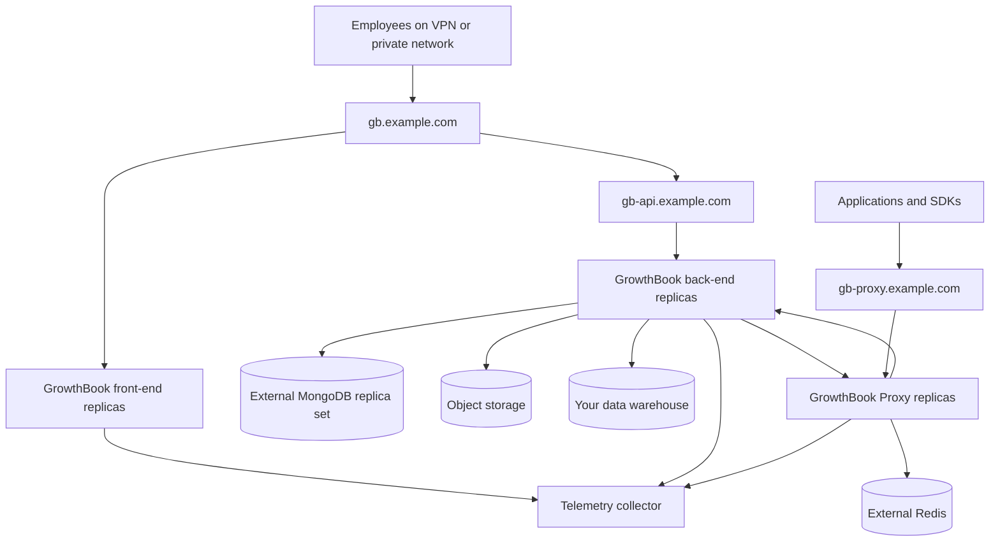

## TL;DR

This guide deploys and operates a self-managed GrowthBook control plane on Kubernetes with external MongoDB, Redis-backed feature delivery, durable object storage, TLS, observability, backups, and named operational ownership. It separates the private administrative surface from the application-facing proxy and treats running pods as the start of production readiness, not the end.

The 0 → 1 → 100 sequence pins and renders configuration before cluster writes, deploys dependencies and GrowthBook in a controlled order, verifies one SDK path, then proves degraded operation, restore, rollback, scaling, and upgrades. Use this path only when the organization genuinely needs self-hosting and has a platform team prepared to own stateful infrastructure and incidents.

_This guide is optimized for AI coding agents, and it is recommended that you hand it off to your agent of choice for implementation._

## Guide map

| Phase | What the agent does | Receipt to return |
| --- | --- | --- |
| 0 — Design and render | Record owners and recovery targets, pin versions, define secrets and external state, and render manifests without writing to the cluster | Reviewed values, parsed manifests, security checks, and dependency reachability |
| 1 — Deploy and smoke test | Apply in dependency order, connect one SDK, verify feature delivery, and test bounded failures | Healthy workloads, feature-fetch receipt, cached evaluation, and rollback proof |
| 100 — Operate the service | Add alerts, backups, restore drills, upgrades, scaling rules, and incident ownership | Monitoring, recovery test, upgrade record, RTO/RPO evidence, and runbook handoff |

## Give this guide to your coding agent

Copy this page's URL and the prompt below into a coding agent that can inspect your infrastructure repository. Replace `REPLACE_WITH_REPOSITORY` with the repository path or name and `REPLACE_WITH_GUIDE_URL` with this page's public URL. Start in a branch, worktree, or disposable clone. The first pass should render and validate files without applying them to a cluster.

```text
You are working in REPLACE_WITH_REPOSITORY.

Your task is to produce and validate a production-oriented self-hosted GrowthBook
design and Kubernetes configuration that fits this organization's existing
platform conventions. Render and inspect the proposed resources; do not apply
them to a cluster during the initial pass.

Read REPLACE_WITH_GUIDE_URL in full before editing. Also read the repository's
local agent instructions. Treat the operator's instructions, repository truth,
and current official GrowthBook, Kubernetes, chart, and infrastructure
documentation as authoritative when they conflict with the guide. Revalidate all
pinned versions, image behavior, chart values, and volatile surfaces before
copying an executable step.

Do not invent domains, credentials, secret-manager paths, warehouse access,
recovery objectives, owners, or provider resources. Reuse the organization's
infrastructure-as-code, ingress, secret, database, storage, and observability
patterns. Complete phase 0 and render-only validation. Do not run kubectl apply,
helm install/upgrade/rollback, a restore drill, a failure injection, or another
external write unless I explicitly authorize that exact action.

Return: your fit or reject decision; missing operator decisions; assumptions;
files changed; rendered manifests and validation commands; security, dependency,
feature-delivery, outage, backup/restore, and rollback plans or receipts;
deviations from the guide; and the remaining cluster actions. If you cannot fetch
the guide URL, stop and ask me for its Markdown version. Do not proceed from the
TL;DR alone.
```

## Task

Deploy a production-oriented GrowthBook control plane to Kubernetes and deliver feature payloads through a separately scalable GrowthBook Proxy. Keep MongoDB, Redis, object storage, TLS, DNS, backups, and alerting explicit. Prove that SDKs continue to evaluate cached feature definitions during a control-plane interruption, and leave an upgrade and recovery procedure another operator can execute.

This is an operating guide, not merely an install command. `helm install` can create running pods in minutes. Production begins when the team can answer who patches them, who restores MongoDB, how long SDKs can tolerate an outage, which endpoint is public, how secrets rotate, and how a bad release rolls back.

## Use this guide when

- Regulation, data residency, network boundaries, or internal policy requires a self-managed control plane.
- Your platform team already operates Kubernetes, managed databases, TLS, secret management, backups, and observability.
- You want GrowthBook’s open-source feature flagging and warehouse-native experimentation while controlling its infrastructure.
- You can assign named owners and an on-call response for the service.

## Prefer GrowthBook Cloud when

- The main requirement is “add flags and experiments,” not “own another stateful service.”
- There is no team responsible for database recovery, upgrades, vulnerability response, and capacity planning.
- A cloud-hosted control plane meets the organization’s privacy and network requirements.
- You would otherwise run single-replica MongoDB in the same cluster with no tested restore.

Self-hosting can improve control. It does not make the operational work disappear; it transfers that work to your team.

## End state

The target deployment has:

- three front-end replicas and three back-end replicas spread across failure domains;
- an external MongoDB replica set or managed compatible service with point-in-time recovery;
- S3-compatible or Google Cloud object storage rather than a single-writer uploads volume;
- two private, same-site control-plane names such as `gb.example.com` and `gb-api.example.com`;
- a public or application-reachable proxy name such as `gb-proxy.example.com`;
- at least three proxy replicas using Redis for shared cache and pub/sub;
- TLS at every ingress and encrypted connections to external state stores;
- non-root containers with read-only root filesystems and explicit writable `/tmp` mounts;
- metrics, logs, traces, synthetic feature-fetch checks, and actionable alerts;
- version-pinned images and chart values in Git, with secrets outside Git;
- tested MongoDB restore, Helm rollback, proxy outage, and control-plane outage procedures;
- a warehouse connection with least privilege for experiment analysis;
- an owner, recovery-time objective, recovery-point objective, and maintenance schedule.

## Reference architecture



The control plane is where people configure flags and experiments. The data plane is where SDKs fetch or stream feature definitions. Isolating these paths lets you keep the larger administrative surface private and scale feature delivery independently.

## What this guide deliberately does not automate

The reference files do not create a production MongoDB cluster, Redis cluster, object-storage bucket, DNS zone, certificate issuer, ingress controller, or warehouse. Those are provider- and organization-specific resources with their own recovery and access models. Provision them through the platform’s existing infrastructure-as-code system before applying the GrowthBook release.

Do not paste cloud credentials into Helm values. Use workload identity where possible and your existing external-secret controller or secret delivery system.

## Required decisions and inputs

Record these values in the deployment pull request:

```text
Kubernetes cluster/context:
Namespace: growthbook
Control-plane app URL: https://gb.example.com
Control-plane API URL: https://gb-api.example.com
Feature proxy URL: https://gb-proxy.example.com
GrowthBook version: 5.0.0
Helm chart version: 5.0.0
Proxy version: 1.4.0
MongoDB service/owner:
Redis service/owner:
Object-storage bucket/owner:
Secret manager path/owner:
Ingress class and TLS issuer:
Telemetry collector endpoint:
Warehouse and least-privilege role:
RTO / RPO:
Primary operator / on-call service:
```

Use separate hostnames for the front end and API. The GrowthBook front end also has `/api` routes, so the front end and back end cannot share one hostname and port. Authentication cookies require the app and API to be same-site; sibling subdomains under one registrable domain satisfy that topology.

## Prerequisites

The implementing machine or CI runner needs:

```bash
helm version
kubectl version --client
kubectl config current-context
```

This guide assumes Helm 4 or a supported Helm 3 release and a Kubernetes version supported by your platform. It does not assume local cluster-admin access. Use the smallest deployment role that can manage namespaced workloads, Services, Ingresses, ConfigMaps, and the secret references your platform permits.

Verify external dependencies before the release:

```bash
# Run these from an approved diagnostic pod or network location.
nc -vz MONGODB_HOST 27017
nc -vz REDIS_HOST 6379
curl --fail --silent --show-error https://YOUR_OTEL_COLLECTOR_HEALTH_ENDPOINT
```

For TLS database URLs, use the provider’s CA and validation settings. Never solve a certificate error with a global “disable verification” flag in production.

## Directory layout

Create:

```text
ops/growthbook/
  namespace.yaml
  secrets.example.yaml
  values.production.yaml
  proxy.yaml
  availability.yaml
  kustomization.yaml
  smoke.sh
```

Commit every file except the rendered secret. A real secret should be materialized by your external-secret system or applied from an encrypted delivery path.

## Stage 0: pin source and inspect release notes

The current public chart is an OCI artifact. Pull the exact version before editing values:

```bash
mkdir -p .artifacts/growthbook
helm pull oci://ghcr.io/growthbook/charts/growthbook \
  --version 5.0.0 \
  --destination .artifacts/growthbook
helm show chart oci://ghcr.io/growthbook/charts/growthbook --version 5.0.0
helm show values oci://ghcr.io/growthbook/charts/growthbook --version 5.0.0 \
  > .artifacts/growthbook/upstream-values-5.0.0.yaml
```

Compare the shown values with this guide. Do not use an unpinned `latest` image or omit `--version` in production automation.

The GrowthBook 5.0.0 image is hardened: its runtime is distroless, runs as UID 1000, and does not contain a shell. The current chart invokes `pm2-runtime` through Node, sets a read-only root filesystem, mounts writable `/tmp`, and uses `fsGroup: 1000`. Do not override those defaults with `command: ["sh", ...]`, and do not make the root filesystem writable merely to restore old debugging habits.

## Stage 1: namespace and secret contract

```yaml title="ops/growthbook/namespace.yaml"
apiVersion: v1
kind: Namespace
metadata:
  name: growthbook
  labels:
    app.kubernetes.io/part-of: growthbook
    pod-security.kubernetes.io/enforce: restricted
    pod-security.kubernetes.io/audit: restricted
    pod-security.kubernetes.io/warn: restricted
```

The following file documents secret keys only. Do not commit a populated copy.

```yaml title="ops/growthbook/secrets.example.yaml"
apiVersion: v1
kind: Secret
metadata:
  name: growthbook-runtime
  namespace: growthbook
type: Opaque
stringData:
  jwt-secret: REPLACE_WITH_AT_LEAST_32_RANDOM_BYTES
  encryption-key: REPLACE_WITH_AT_LEAST_32_RANDOM_BYTES
  mongodb-uri: mongodb+srv://REPLACE_ME/growthbook?retryWrites=true&w=majority
  proxy-secret-api-key: REPLACE_WITH_A_RANDOM_READONLY_KEY
  redis-url: rediss://REPLACE_ME
---
apiVersion: v1
kind: Secret
metadata:
  name: growthbook-smtp
  namespace: growthbook
type: Opaque
stringData:
  username: REPLACE_ME
  password: REPLACE_ME
```

Generate independent values through your secret manager, for example with a cryptographically secure 32-byte generator. `JWT_SECRET` signs authentication state. `ENCRYPTION_KEY` protects stored data-source credentials. Losing either has operational consequences; rotating `ENCRYPTION_KEY` requires the documented credential migration. Back up the keys under the same recovery controls as the database.

The proxy key must either be a readonly API key created under **Settings → API Keys** or a custom `SECRET_API_KEY` configured identically on the GrowthBook back end and proxy. Never use an admin key when readonly access is sufficient.

## Stage 2: production Helm values

This baseline uses external MongoDB and object storage, so all application replicas remain stateless. Replace the domain, storage, identity, ingress, and telemetry placeholders.

```yaml title="ops/growthbook/values.production.yaml"
global:
  env:
    - name: APP_ORIGIN
      value: https://gb.example.com
    - name: NODE_ENV
      value: production

frontend:
  replicaCount: 3
  image:
    repository: growthbook/growthbook
    tag: "5.0.0"
    pullPolicy: IfNotPresent
  serviceAccount:
    create: true
    automount: false
  podSecurityContext:
    fsGroup: 1000
    seccompProfile:
      type: RuntimeDefault
  securityContext:
    allowPrivilegeEscalation: false
    capabilities:
      drop: ["ALL"]
    readOnlyRootFilesystem: true
    runAsNonRoot: true
    runAsUser: 1000
  resources:
    requests:
      cpu: 500m
      memory: 1Gi
    limits:
      memory: 2Gi
  autoscaling:
    enabled: true
    minReplicas: 3
    maxReplicas: 10
    targetCPUUtilizationPercentage: 70
  livenessProbe:
    httpGet:
      path: /
      port: http
    initialDelaySeconds: 30
    periodSeconds: 20
    timeoutSeconds: 5
    failureThreshold: 3
  readinessProbe:
    httpGet:
      path: /
      port: http
    initialDelaySeconds: 10
    periodSeconds: 10
    timeoutSeconds: 5
    failureThreshold: 3
  env:
    - name: API_HOST
      value: https://gb-api.example.com

backend:
  replicaCount: 3
  image:
    repository: growthbook/growthbook
    tag: "5.0.0"
    pullPolicy: IfNotPresent
  mongodbEnabled: false
  volumeClaim:
    enabled: false
  serviceAccount:
    create: true
    automount: false
    annotations:
      # Replace with your workload-identity annotation, or remove this block.
      example.com/workload-identity: growthbook-uploads
  podSecurityContext:
    fsGroup: 1000
    seccompProfile:
      type: RuntimeDefault
  securityContext:
    allowPrivilegeEscalation: false
    capabilities:
      drop: ["ALL"]
    readOnlyRootFilesystem: true
    runAsNonRoot: true
    runAsUser: 1000
  resources:
    requests:
      cpu: "1"
      memory: 2Gi
    limits:
      memory: 4Gi
  autoscaling:
    enabled: true
    minReplicas: 3
    maxReplicas: 12
    targetCPUUtilizationPercentage: 70
  livenessProbe:
    httpGet:
      path: /healthcheck
      port: http
    initialDelaySeconds: 45
    periodSeconds: 20
    timeoutSeconds: 5
    failureThreshold: 3
  readinessProbe:
    httpGet:
      path: /healthcheck
      port: http
    initialDelaySeconds: 15
    periodSeconds: 10
    timeoutSeconds: 5
    failureThreshold: 3
  env:
    - name: MONGODB_URI
      valueFrom:
        secretKeyRef:
          name: growthbook-runtime
          key: mongodb-uri
    - name: JWT_SECRET
      valueFrom:
        secretKeyRef:
          name: growthbook-runtime
          key: jwt-secret
    - name: ENCRYPTION_KEY
      valueFrom:
        secretKeyRef:
          name: growthbook-runtime
          key: encryption-key
    - name: SECRET_API_KEY
      valueFrom:
        secretKeyRef:
          name: growthbook-runtime
          key: proxy-secret-api-key
    - name: SECRET_API_KEY_ROLE
      value: readonly
    - name: PROXY_ENABLED
      value: "1"
    - name: PROXY_HOST_PUBLIC
      value: https://gb-proxy.example.com
    - name: UPLOAD_METHOD
      value: s3
    - name: S3_BUCKET
      value: REPLACE_GROWTHBOOK_UPLOAD_BUCKET
    - name: S3_REGION
      value: REPLACE_REGION
    - name: EMAIL_ENABLED
      value: "true"
    - name: EMAIL_HOST
      value: REPLACE_SMTP_HOST
    - name: EMAIL_PORT
      value: "587"
    - name: EMAIL_HOST_USER
      valueFrom:
        secretKeyRef:
          name: growthbook-smtp
          key: username
    - name: EMAIL_HOST_PASSWORD
      valueFrom:
        secretKeyRef:
          name: growthbook-smtp
          key: password
    - name: EMAIL_FROM
      value: growthbook@example.com
    - name: TRACING_PROVIDER
      value: opentelemetry
    - name: OTEL_SERVICE_NAME
      value: growthbook-backend
    - name: OTEL_EXPORTER_OTLP_ENDPOINT
      value: http://otel-collector.observability.svc.cluster.local:4318
    - name: EXPRESS_TRUST_PROXY_OPTS
      # Confirm the hop count for your ingress. "1" is an example, not universal.
      value: "1"

mongodb:
  enabled: false

ingress:
  enabled: true
  className: nginx
  annotations:
    cert-manager.io/cluster-issuer: letsencrypt-production
    nginx.ingress.kubernetes.io/proxy-body-size: 10m
  hosts:
    - host: gb.example.com
      paths:
        - path: /
          pathType: Prefix
          service: frontend
    - host: gb-api.example.com
      paths:
        - path: /
          pathType: Prefix
          service: backend
  tls:
    - secretName: growthbook-control-plane-tls
      hosts:
        - gb.example.com
        - gb-api.example.com
```

Why these choices:

- `backend.mongodbUri` is not used because putting a URI directly in Helm values stores it in release state. A secret-backed `MONGODB_URI` environment variable avoids that leak.
- `mongodb.enabled: false` avoids deploying the chart’s convenience MongoDB dependency. The official production guidance recommends a managed service or a three-node replica set.
- Object storage removes the single-writer uploads PVC. With local uploads and `ReadWriteOnce`, horizontally scaled pods do not share one consistent filesystem.
- CPU limits are omitted to reduce throttling risk; memory limits remain. Adjust from measurements and platform policy.
- The current chart supplies writable `/tmp` volumes required by `readOnlyRootFilesystem`.
- The application image is pinned. A digest pin is even stronger if your image promotion system supports it.

GrowthBook’s production guidance recommends at least 2 GiB RAM and 1 vCPU for application instances and at least three instances for maximum fault tolerance. Treat this as a starting point; experiment volume, stats jobs, payload size, and organization count affect capacity.

If using Google Cloud Storage, replace the S3 settings with `UPLOAD_METHOD=google-cloud`, `GCS_BUCKET_NAME`, and an appropriate workload identity. If your S3-compatible provider needs a custom domain, follow the current environment-variable documentation.

## Stage 3: add the feature-delivery proxy

The official chart does not currently deploy GrowthBook Proxy. Manage it as a separate pinned workload.

```yaml title="ops/growthbook/proxy.yaml"
apiVersion: apps/v1
kind: Deployment
metadata:
  name: growthbook-proxy
  namespace: growthbook
  labels: &labels
    app.kubernetes.io/name: growthbook-proxy
    app.kubernetes.io/part-of: growthbook
spec:
  replicas: 3
  strategy:
    type: RollingUpdate
    rollingUpdate:
      maxUnavailable: 0
      maxSurge: 1
  selector:
    matchLabels: *labels
  template:
    metadata:
      labels: *labels
    spec:
      serviceAccountName: growthbook-proxy
      automountServiceAccountToken: false
      securityContext:
        seccompProfile:
          type: RuntimeDefault
      topologySpreadConstraints:
        - maxSkew: 1
          topologyKey: topology.kubernetes.io/zone
          whenUnsatisfiable: ScheduleAnyway
          labelSelector:
            matchLabels: *labels
        - maxSkew: 1
          topologyKey: kubernetes.io/hostname
          whenUnsatisfiable: ScheduleAnyway
          labelSelector:
            matchLabels: *labels
      containers:
        - name: proxy
          image: growthbook/proxy:1.4.0
          imagePullPolicy: IfNotPresent
          ports:
            - name: http
              containerPort: 3300
          securityContext:
            allowPrivilegeEscalation: false
            capabilities:
              drop: ["ALL"]
            runAsNonRoot: true
          env:
            - name: NODE_ENV
              value: production
            - name: GROWTHBOOK_API_HOST
              value: http://growthbook-backend:3100
            - name: SECRET_API_KEY
              valueFrom:
                secretKeyRef:
                  name: growthbook-runtime
                  key: proxy-secret-api-key
            - name: CACHE_ENGINE
              value: redis
            - name: CACHE_CONNECTION_URL
              valueFrom:
                secretKeyRef:
                  name: growthbook-runtime
                  key: redis-url
            - name: CACHE_REFRESH_STRATEGY
              value: stale-while-revalidate
            - name: CACHE_STALE_TTL
              value: "60"
            - name: CACHE_EXPIRES_TTL
              value: "3600"
            - name: CACHE_ALLOW_STALE
              value: "true"
            - name: PUBLISH_PAYLOAD_TO_CHANNEL
              value: "1"
            - name: ENABLE_EVENT_STREAM
              value: "1"
          resources:
            requests:
              cpu: 250m
              memory: 256Mi
            limits:
              memory: 1Gi
          readinessProbe:
            httpGet:
              path: /healthcheck
              port: http
            initialDelaySeconds: 5
            periodSeconds: 10
            timeoutSeconds: 3
            failureThreshold: 3
          livenessProbe:
            httpGet:
              path: /healthcheck
              port: http
            initialDelaySeconds: 15
            periodSeconds: 20
            timeoutSeconds: 3
            failureThreshold: 3
---
apiVersion: v1
kind: ServiceAccount
metadata:
  name: growthbook-proxy
  namespace: growthbook
automountServiceAccountToken: false
---
apiVersion: v1
kind: Service
metadata:
  name: growthbook-proxy
  namespace: growthbook
  labels:
    app.kubernetes.io/name: growthbook-proxy
    app.kubernetes.io/part-of: growthbook
spec:
  selector:
    app.kubernetes.io/name: growthbook-proxy
    app.kubernetes.io/part-of: growthbook
  ports:
    - name: http
      port: 3300
      targetPort: http
---
apiVersion: networking.k8s.io/v1
kind: Ingress
metadata:
  name: growthbook-proxy
  namespace: growthbook
  annotations:
    cert-manager.io/cluster-issuer: letsencrypt-production
    nginx.ingress.kubernetes.io/proxy-buffering: "off"
    nginx.ingress.kubernetes.io/proxy-read-timeout: "3600"
spec:
  ingressClassName: nginx
  tls:
    - secretName: growthbook-proxy-tls
      hosts: [gb-proxy.example.com]
  rules:
    - host: gb-proxy.example.com
      http:
        paths:
          - path: /
            pathType: Prefix
            backend:
              service:
                name: growthbook-proxy
                port:
                  name: http
```

The service name `growthbook-backend` assumes Helm release name `growthbook`; verify it in rendered output. The public proxy must be able to reach the private back end, Redis, and DNS. It does not need Kubernetes API credentials.

Redis is required for coherent horizontally scaled proxy caching and pub/sub. In-memory cache is acceptable for a local trial or one replica, but replicas can otherwise update at different times. Proxy 1.4.0 supports Redis Sentinel and Cluster options if your platform uses them.

`/healthcheck` is intentionally simple and synchronous. Use `/healthcheck/checks` for deeper diagnostics from a protected monitoring path, not necessarily as a liveness probe. A dependency blip should not create a restart storm.

## Stage 4: availability controls

The chart does not expose topology spread or PodDisruptionBudgets for its aliased workloads. Add budgets after rendering labels and confirming the selectors:

```yaml title="ops/growthbook/availability.yaml"
apiVersion: policy/v1
kind: PodDisruptionBudget
metadata:
  name: growthbook-frontend
  namespace: growthbook
spec:
  minAvailable: 2
  selector:
    matchLabels:
      app.kubernetes.io/instance: growthbook
      app.kubernetes.io/name: growthbook
      app.kubernetes.io/component: frontend
---
apiVersion: policy/v1
kind: PodDisruptionBudget
metadata:
  name: growthbook-backend
  namespace: growthbook
spec:
  minAvailable: 2
  selector:
    matchLabels:
      app.kubernetes.io/instance: growthbook
      app.kubernetes.io/name: growthbook
      app.kubernetes.io/component: backend
---
apiVersion: policy/v1
kind: PodDisruptionBudget
metadata:
  name: growthbook-proxy
  namespace: growthbook
spec:
  minAvailable: 2
  selector:
    matchLabels:
      app.kubernetes.io/name: growthbook-proxy
      app.kubernetes.io/part-of: growthbook
```

Before applying these, inspect the rendered Deployment selectors. A PodDisruptionBudget with a nonmatching selector provides no protection.

For strict multi-zone availability, the current chart may require a small downstream chart patch to expose `topologySpreadConstraints` for front end and back end. Document that patch and rebase it on each chart upgrade. Pod anti-affinity is another option, but `required` rules can make deployments unschedulable in small clusters.

## Stage 5: render, validate, and review before cluster writes

Create a kustomization for the non-Helm resources:

```yaml title="ops/growthbook/kustomization.yaml"
apiVersion: kustomize.config.k8s.io/v1beta1
kind: Kustomization
resources:
  - namespace.yaml
  - proxy.yaml
  - availability.yaml
```

Render the Helm release locally:

```bash
helm template growthbook oci://ghcr.io/growthbook/charts/growthbook \
  --version 5.0.0 \
  --namespace growthbook \
  --values ops/growthbook/values.production.yaml \
  > .artifacts/growthbook/rendered.yaml

kubectl apply --dry-run=client --validate=true \
  --filename .artifacts/growthbook/rendered.yaml
kubectl apply --dry-run=client --validate=true \
  --kustomize ops/growthbook
```

Inspect the rendered security and secret surfaces:

```bash
grep -nE 'image:|runAsUser:|runAsNonRoot:|readOnlyRootFilesystem:|MONGODB_URI|JWT_SECRET|ENCRYPTION_KEY|kind: Ingress|host:' \
  .artifacts/growthbook/rendered.yaml
```

Required review receipts:

```text
[ ] No secret value appears in rendered.yaml or values.production.yaml
[ ] Image tags are pinned
[ ] MongoDB subchart is absent
[ ] Front end and back end each render three replicas or an HPA min of three
[ ] Front end points to the public/private API hostname intended for employee browsers
[ ] Back end receives MONGODB_URI/JWT_SECRET/ENCRYPTION_KEY from Secret refs
[ ] Back end has PROXY_ENABLED and the correct public proxy hostname
[ ] Root filesystem remains read-only and runAsUser remains 1000 for GrowthBook 5.0.0
[ ] Writable /tmp mounts are present
[ ] Ingress TLS hosts exactly match APP_ORIGIN and API_HOST
[ ] PDB selectors match rendered pod labels
```

Use a policy engine such as Kyverno, Gatekeeper, or Conftest in CI if your platform has one. At minimum, reject `latest`, privileged containers, host namespaces, writable root filesystems, and inline Secret values.

## Stage 6: deploy in dependency order

1. Confirm MongoDB backups and connectivity.
2. Confirm Redis availability and connectivity.
3. Create the object-storage bucket and workload identity.
4. Materialize secrets from the approved secret manager.
5. Apply namespace and proxy-independent policies.
6. Install GrowthBook.
7. Apply proxy and availability manifests.
8. Create DNS only after ingress addresses exist.
9. Validate TLS and same-site authentication.

Commands:

```bash
kubectl apply --filename ops/growthbook/namespace.yaml

# Replace with your external-secret workflow. Do not use secrets.example.yaml.
kubectl get secret growthbook-runtime --namespace growthbook
kubectl get secret growthbook-smtp --namespace growthbook

helm upgrade --install growthbook oci://ghcr.io/growthbook/charts/growthbook \
  --version 5.0.0 \
  --namespace growthbook \
  --values ops/growthbook/values.production.yaml \
  --atomic \
  --timeout 15m \
  --history-max 10

kubectl apply --filename ops/growthbook/proxy.yaml
kubectl apply --filename ops/growthbook/availability.yaml

kubectl rollout status deployment/growthbook-frontend --namespace growthbook --timeout=10m
kubectl rollout status deployment/growthbook-backend --namespace growthbook --timeout=10m
kubectl rollout status deployment/growthbook-proxy --namespace growthbook --timeout=10m
```

`--atomic` removes a failed new install or rolls back a failed upgrade. It does not roll back an external database migration or restore a rotated secret. Read release notes and back up state before upgrades.

List actual names instead of assuming them:

```bash
kubectl get deploy,po,svc,ingress,hpa,pdb --namespace growthbook --show-labels
helm status growthbook --namespace growthbook
helm get values growthbook --namespace growthbook
```

## Stage 7: initialize and connect an SDK

Open `https://gb.example.com` from the approved network and create the initial organization/admin. Immediately:

1. configure SMTP and test an invite/reset message;
2. create least-privilege roles and remove unnecessary admins;
3. create a readonly proxy API key if you did not use the custom shared key path;
4. create a project and environment policy;
5. create an SDK Connection;
6. set its proxy host to `https://gb-proxy.example.com` if required by the UI;
7. create a boolean feature named `platform-smoke-test` with default `false`;
8. publish it to the non-production environment first.

Point an SDK to the proxy, retaining the same SDK client key:

```ts
import { GrowthBook } from "@growthbook/growthbook";

const gb = new GrowthBook({
  apiHost: "https://gb-proxy.example.com",
  clientKey: process.env.GROWTHBOOK_CLIENT_KEY,
  attributes: { id: "synthetic-check" },
});

const result = await gb.init({ timeout: 2_000 });
if (!result.success)
  throw result.error ?? new Error(`Feature load: ${result.source}`);

console.log({
  source: result.source,
  value: gb.getFeatureValue("platform-smoke-test", false),
});
gb.destroy();
```

Do not use the synthetic identifier for a real experiment. It is a delivery check only.

## Stage 8: executable smoke checks

```bash title="ops/growthbook/smoke.sh"
#!/usr/bin/env bash
set -euo pipefail

: "${GB_APP_URL:?set GB_APP_URL}"
: "${GB_API_URL:?set GB_API_URL}"
: "${GB_PROXY_URL:?set GB_PROXY_URL}"
: "${GB_CLIENT_KEY:?set GB_CLIENT_KEY}"

curl --fail --silent --show-error --max-time 10 \
  "${GB_APP_URL}/" >/dev/null

curl --fail --silent --show-error --max-time 10 \
  "${GB_API_URL}/healthcheck" >/dev/null

curl --fail --silent --show-error --max-time 10 \
  "${GB_PROXY_URL}/healthcheck" >/dev/null

payload="$(curl --fail --silent --show-error --max-time 10 \
  "${GB_PROXY_URL}/api/features/${GB_CLIENT_KEY}")"

jq -e '.features["platform-smoke-test"] != null' <<<"${payload}" >/dev/null
printf 'GrowthBook control plane, proxy, and smoke feature are reachable.\n'
```

Run from CI or an approved synthetic-monitor location:

```bash
GB_APP_URL=https://gb.example.com \
GB_API_URL=https://gb-api.example.com \
GB_PROXY_URL=https://gb-proxy.example.com \
GB_CLIENT_KEY=sdk_REPLACE_ME \
bash ops/growthbook/smoke.sh
```

Do not print the payload in CI logs. It can expose feature names and targeting logic. Store the SDK key in the CI secret system even though it is not an administrative credential.

## Stage 9: prove degraded behavior

A green install is insufficient. Run these game-day tests in staging before production.

### Control-plane interruption

1. Fetch `platform-smoke-test` through the proxy and record the value.
2. Scale the back end to zero in staging.
3. Fetch the same feature through the proxy.
4. Confirm the cached value remains available according to the configured stale/expiry policy.
5. Change nothing while the control plane is down; changes cannot propagate.
6. Restore the back end and verify health and refresh.

```bash
kubectl scale deployment/growthbook-backend --replicas=0 --namespace growthbook
curl --fail --silent --show-error \
  "https://gb-proxy.example.com/api/features/$GB_CLIENT_KEY" \
  | jq '.features["platform-smoke-test"]'
kubectl scale deployment/growthbook-backend --replicas=3 --namespace growthbook
kubectl rollout status deployment/growthbook-backend --namespace growthbook
```

Only do this in a dedicated staging environment or approved production exercise. HPA may restore replicas; disable or account for it in the test plan.

### One proxy replica failure

Delete one staging proxy pod and continuously request the feature endpoint. There should be no user-visible outage:

```bash
proxy_pod="$(kubectl get pods --namespace growthbook \
  --selector app.kubernetes.io/name=growthbook-proxy \
  --output jsonpath='{.items[0].metadata.name}')"
test -n "$proxy_pod"
kubectl delete pod "$proxy_pod" --namespace growthbook --wait=false
```

### Redis interruption

Simulate Redis unavailability and verify the documented behavior for already cached and uncached SDK Connections. Confirm alerting and recovery. The desired result is not “nothing changes”; it is a known degradation without inconsistent surprise.

### Bad application release

Deploy a deliberately failing image in staging through the same pipeline, confirm `--atomic` behavior, and capture `helm history` plus workload events.

### MongoDB restore

Restore a recent backup to an isolated database, deploy an isolated GrowthBook instance against it, sign in, and verify representative flags, experiments, SDK Connections, users, and data-source definitions. A backup is not proven until it has been restored.

## Observability and alerts

The GrowthBook API supports OpenTelemetry when `TRACING_PROVIDER=opentelemetry` and standard `OTEL_*` variables are set. The proxy can be started with its tracing command; because container command details can change, verify the pinned proxy image’s current documentation before overriding its command.

Collect at least:

- replica availability and restart count for front end, back end, and proxy;
- HTTP rate, error rate, and latency by route class;
- synthetic success and latency for `/api/features/:clientKey` through the proxy;
- proxy cache hit/miss/refresh behavior where exposed;
- Redis and MongoDB connection saturation, errors, storage, replication lag, and failover;
- back-end job duration/failure and stats-engine resource pressure;
- ingress TLS expiry and DNS health;
- object-storage errors;
- event/warehouse query failures relevant to experiment analysis.

Page on user-impacting conditions: feature endpoint failure across replicas, sustained 5xx, MongoDB write/read unavailability, all proxy replicas unavailable, or certificate expiry inside the emergency window. Ticket or notify for capacity trend, one replica down, cache-refresh degradation, or backup lag according to your SLOs.

Avoid alerting only on `/healthcheck`. A process can be alive while SDK payload delivery is broken. The synthetic check must request a known feature through the same public path as applications.

## Network and security model

Start from these rules, then encode them in the platform’s NetworkPolicy/firewall system:

| Source | Destination | Purpose |
| --- | --- | --- |
| Employee/VPN ingress | Front end and API ingress | Administration |
| Front end | Back end | UI API requests |
| Back end | MongoDB | Configuration and application state |
| Back end | Object storage | Uploaded images/screenshots |
| Back end | Warehouse | Read-only analysis queries; optional dedicated write schema for Pipeline Mode |
| Back end | Proxy | Feature-definition updates/webhooks |
| Applications | Proxy ingress | Feature fetch, streaming, remote evaluation if enabled |
| Proxy | Back end | SDK Connection metadata and payload refresh |
| Proxy | Redis | Distributed cache/pub/sub |
| Workloads | DNS and telemetry collector | Name resolution and telemetry |

Keep the main app and API behind a firewall or VPN when possible. If a CDN is used instead of the proxy, expose only `/api/features/*`; exposing the entire API defeats the boundary. The proxy has a smaller purpose-built surface but still requires normal WAF, rate-limiting, patching, and monitoring.

Use payload encryption when feature definitions contain sensitive business logic, and keep decryption keys only in trusted server-side applications. Client-side applications cannot keep a decryption secret from their users. Remote evaluation can hide targeting rules from clients but changes latency and failure dependencies; threat-model and load-test it before enabling.

## Warehouse access for experimentation

GrowthBook stores its own application state in MongoDB, but warehouse-native experiment analysis queries your event warehouse. Create a dedicated warehouse identity:

- read access only to required exposure, fact, metric, and dimension data;
- no broad write permission;
- network access only from the GrowthBook back end;
- query timeout and cost controls appropriate to the warehouse;
- audit logging;
- credential rotation through the secret manager.

If Pipeline Mode is enabled, grant write access only to a dedicated schema for GrowthBook’s temporary/intermediate tables. Do not grant write access to production source schemas.

Test queries against realistic data volumes before enabling frequent automatic updates. A highly available control plane can still produce expensive or slow analysis if fact tables are unpartitioned or metrics perform repeated large scans.

## Backups and disaster recovery

### MongoDB

MongoDB contains users, organizations, feature definitions, experiments, SDK Connections, and data-source configuration. Define:

- point-in-time recovery or backup interval that meets RPO;
- cross-zone and, if required, cross-region copies;
- retention and immutability;
- restore credentials and a quarterly restore exercise;
- monitoring for backup freshness and replication lag.

### Secrets

Back up or escrow `JWT_SECRET` and `ENCRYPTION_KEY` under restricted recovery access. Changing `ENCRYPTION_KEY` without the migration process makes stored data-source credentials unreadable.

### Uploads

Enable object versioning/retention according to policy. Uploads are not in MongoDB.

### Git and release state

Keep values, manifests, image digests, and runbooks in Git. Keep enough Helm history for fast rollback, but do not treat Helm release secrets as a database backup.

### Recovery order

1. Restore/verify MongoDB and encryption secrets.
2. Restore object-storage access.
3. Restore Redis or allow the proxy to rebuild cache from the back end.
4. Deploy the pinned last-known-good GrowthBook release.
5. Deploy the pinned proxy release.
6. Run control-plane and feature-delivery smoke tests.
7. Verify representative flags and experiment definitions.
8. Resume writes and notify stakeholders.

## Upgrades

Never combine a GrowthBook major upgrade, MongoDB major upgrade, ingress replacement, and secret rotation in one change.

For each GrowthBook upgrade:

1. Read release notes and chart diffs from the current version to the target.
2. Pull and inspect the target chart.
3. Diff `helm show values` against your values.
4. Render and validate manifests in CI.
5. Back up MongoDB and confirm backup freshness.
6. Deploy to staging with production-shaped data and traffic.
7. Run login, create/edit/publish flag, feature fetch, streaming, experiment query, email, and upload tests.
8. Test rollback before production.
9. Deploy during the agreed window with `--atomic`.
10. Watch application, proxy, database, and SDK-delivery telemetry.

Useful commands:

```bash
helm diff upgrade growthbook oci://ghcr.io/growthbook/charts/growthbook \
  --version TARGET_VERSION \
  --namespace growthbook \
  --values ops/growthbook/values.production.yaml

helm history growthbook --namespace growthbook
helm rollback growthbook PREVIOUS_REVISION --namespace growthbook --wait --timeout 15m
```

`helm diff` requires the separately installed plugin. If your CI does not use it, diff rendered manifests with the organization’s normal review tool.

The 5.0.0 hardening change is an example of why chart/image coupling matters. The distroless image cannot execute shell shims; the chart invokes Node directly and supplies the writable paths/non-root ownership the image expects. Upgrading only the image while retaining an older chart can break startup or uploads. Upgrade the chart and application as a reviewed pair unless release documentation says otherwise.

## Debugging a distroless container

These commands will fail on the hardened image:

```bash
kubectl exec -it POD -- sh
kubectl exec -it POD -- bash
```

Use logs, events, port-forwarding, or an approved ephemeral debug container:

```bash
kubectl logs deployment/growthbook-backend --namespace growthbook --all-pods=true --tail=200
kubectl describe pod POD_NAME --namespace growthbook
kubectl get events --namespace growthbook --sort-by=.lastTimestamp
kubectl port-forward service/growthbook-backend 3100:3100 --namespace growthbook

# Requires the cluster's ephemeral-container policy and an approved debug image.
kubectl debug -it pod/POD_NAME --namespace growthbook \
  --image=busybox:1.36.1 \
  --target=server
```

The rendered container name may differ; inspect the pod spec before using `--target`. Pin and approve debug images just like production images. Remove or let ephemeral debug access expire according to incident policy.

Do not weaken the production workload’s security context to gain a shell.

## Troubleshooting matrix

| Symptom | Likely cause | Checks | Corrective action |
| --- | --- | --- | --- |
| Front end loads but login/API fails | Wrong `API_HOST`, CORS/same-site topology, TLS, or ingress routing | Browser network panel; rendered env; ingress events | Use sibling domains and correct front-end `API_HOST` |
| Back end crash-loops at startup | Missing Mongo/JWT/encryption secret, incompatible chart/image, DB TLS | pod logs; Secret key names; rendered command | Restore secret refs; use paired chart/image |
| Uploads fail with permission error | Local PVC ownership or missing object-storage identity | logs; pod mounts; workload identity | Prefer object storage; keep UID/fsGroup 1000 for local volume |
| `exec sh` fails | Expected distroless behavior | image/version | Use logs or ephemeral debug container |
| Proxy is healthy but feature is absent | Wrong client key, stale SDK Connection metadata, back-end auth/key mismatch | `/healthcheck/checks`; proxy logs; connection config | Align readonly key and refresh connection metadata |
| Proxy replicas disagree | In-memory cache or Redis/pub-sub misconfiguration | env, Redis health, repeated requests by pod | Use Redis cache plus `PUBLISH_PAYLOAD_TO_CHANNEL=1` |
| Feature delivery fails when API is down | Cache never warmed, entry expired, wrong refresh policy | proxy cache config and logs | Warm/check payloads; set an explicit stale/expiry policy matching outage budget |
| Authentication redirects loop | App/API are cross-site or proxy hop trust is wrong | cookies, origin headers, `APP_ORIGIN`, `API_HOST` | Correct same-site domains and validated trust-proxy setting |
| Data-source credentials fail after key change | `ENCRYPTION_KEY` rotated without migration | secret history and app logs | Restore prior key, then run documented migration |
| Experiment results empty | Warehouse identity/join/identifier problem, not flag delivery | experiment query, exposure rows, identifier type | Fix source/identifier mapping; do not change assignment mid-phase |
| Pods OOM during result updates | stats workload and web/API share resources | memory, job timing, experiment count | Increase capacity; evaluate a dedicated jobs server from current production docs |

## Scale beyond the baseline

For many or computationally heavy experiments, stats jobs can contend with interactive requests. GrowthBook supports a dedicated jobs server using `PYTHON_SERVER_MODE`, `EXTERNAL_PYTHON_SERVER_URL`, pool-size variables, and an optional shared `PYTHON_SERVER_AUTH_TOKEN`. The `/stats` endpoint has no built-in authentication unless that token is configured and must remain on a private network.

Treat this as a second architecture phase:

1. measure contention first;
2. create a separately sized private workload;
3. set the same random auth token on callers and jobs server;
4. deny public ingress;
5. load-test representative analyses;
6. add independent health and saturation alerts.

Do not copy environment variables from an old runbook without checking the current [production documentation](https://docs.growthbook.io/self-host/production).

## Rollback

Use the smallest rollback that matches the failure:

### Proxy-only failure

Roll the proxy Deployment back without touching the GrowthBook control plane or MongoDB:

```bash
kubectl rollout history deployment/growthbook-proxy --namespace growthbook
kubectl rollout undo deployment/growthbook-proxy --namespace growthbook
kubectl rollout status deployment/growthbook-proxy --namespace growthbook --timeout=10m
bash ops/growthbook/smoke.sh
```

If the new proxy changed cache schema or Redis keys, follow that proxy release's compatibility notes. A Deployment rollback does not revert external Redis state.

### GrowthBook release failure

Inspect revisions, select the last-known-good chart/application pair, and roll back:

```bash
helm history growthbook --namespace growthbook
helm rollback growthbook PREVIOUS_REVISION \
  --namespace growthbook \
  --wait \
  --timeout 15m
kubectl get pods --namespace growthbook
bash ops/growthbook/smoke.sh
```

Verify login, a representative feature edit/publish, SDK payload delivery through the proxy, uploads, and one experiment query. Do not declare recovery from pod readiness alone.

### State or secret failure

Helm rollback does not restore MongoDB, object storage, Redis, or a rotated `ENCRYPTION_KEY`. Stop writes if continuing would worsen the incident, restore the matching database/secret set through the tested disaster-recovery runbook, then deploy the compatible application version. Record the recovered point in time and any configuration changes that may have been lost.

### Emergency feature-delivery continuity

If the control plane is unavailable but the proxy serves a valid cached payload, avoid restarting or flushing healthy proxy replicas until the control plane is restored. If both layers are unavailable, SDK behavior depends on each SDK's local cache, initialization timeout, and code fallback. Those application fallbacks must be tested independently; Kubernetes rollback cannot manufacture a payload an SDK never cached.

## DIY versus GrowthBook

A team can serve a JSON file from object storage and evaluate `if` statements. That is a valid low-complexity feature-flag system when there are few flags, one application, one operator, low blast radius, and no experimentation requirement.

The platform cost appears as the system grows:

- deterministic cross-language evaluation and targeting semantics;
- safe environment separation and controlled publication;
- SDK caching, streaming, fallback, and payload encryption;
- proxy delivery, shared cache, and real-time invalidation;
- experiment exposure joined to warehouse outcomes;
- health checks such as Sample Ratio Mismatch and multiple exposures;
- permissions, review, audit, stale-flag detection, and cleanup ownership;
- consistent operations across dozens of services and teams.

Self-hosted GrowthBook gives you those product primitives, but **you still own** Kubernetes, MongoDB, Redis, storage, ingress, backups, monitoring, incident response, and upgrades. Cloud GrowthBook shifts more of that operational burden away. The choice is not “free open source versus paid software”; it is which responsibilities your organization wants to own and can execute reliably.

## Definition of done for an implementing agent

Return a deployment report containing:

```text
[ ] Cluster/context and namespace
[ ] GrowthBook chart/app version and image digest
[ ] Proxy version and image digest
[ ] Render/validation output
[ ] Secret-manager references, with no secret values
[ ] MongoDB topology, backup freshness, RPO, and restore-test date
[ ] Redis topology and failover test
[ ] Object-storage configuration and identity
[ ] Control-plane and proxy URLs/TLS receipts
[ ] Workload replica/HPA/PDB status
[ ] Non-root/read-only-root security receipt
[ ] SDK feature-fetch receipt through proxy
[ ] Control-plane outage cache receipt
[ ] One-replica proxy failure receipt
[ ] Login, email, upload, publish, and warehouse-query smoke receipts
[ ] Dashboards and alert links
[ ] Rollback revision and tested command
[ ] Named owner and on-call service
[ ] Upgrade cadence and next review date
```

“Pods are running” is not an acceptable completion report.

## Source map and freshness contract

This guide was verified from:

- [GrowthBook Kubernetes documentation](https://docs.growthbook.io/self-host/kubernetes) and the current [Helm chart source](https://github.com/growthbook/growthbook/tree/e44a15af063860c7118f52508746356d55e5a91d/charts/growthbook).
- [Production best practices](https://docs.growthbook.io/self-host/production) for security, MongoDB, scaling, feature serving, jobs separation, and OpenTelemetry.
- [Self-hosted environment variables](https://docs.growthbook.io/self-host/env) for domains, secrets, uploads, and production settings.
- [GrowthBook Proxy documentation](https://docs.growthbook.io/self-host/proxy) and [proxy source at `82422949`](https://github.com/growthbook/growthbook-proxy/tree/82422949849890a6d0e67a2f1bc403d633afa471).
- [Kubernetes Pod Security Standards](https://kubernetes.io/docs/concepts/security/pod-security-standards/), [probes](https://kubernetes.io/docs/concepts/configuration/liveness-readiness-startup-probes/), [disruption budgets](https://kubernetes.io/docs/tasks/run-application/configure-pdb/), and [ephemeral containers](https://kubernetes.io/docs/concepts/workloads/pods/ephemeral-containers/).
- [MongoDB production notes](https://www.mongodb.com/docs/manual/administration/production-notes/) for database-specific operational guidance.

Reverify before every major/minor upgrade: chart keys and selectors, container UID and writable paths, health endpoints, image command, MongoDB compatibility, proxy environment variables, cache semantics, self-host feature entitlements, and all external dependency versions.
